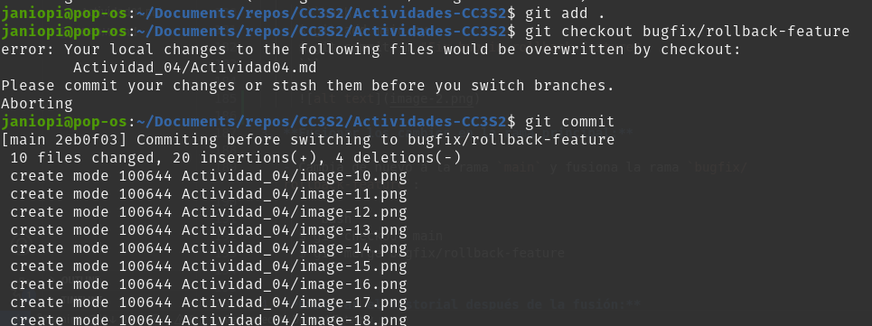
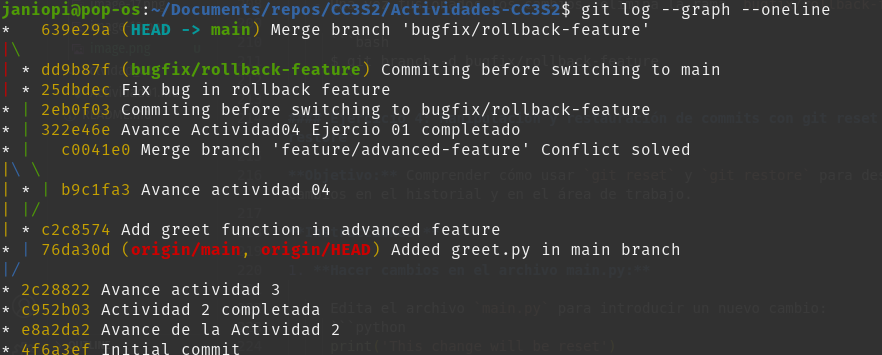

# Ejercicio 1

#### Ejercicios

##### Ejercicio 1: Manejo avanzado de ramas y resolución de conflictos

**Objetivo:** Practicar la creación, fusión y eliminación de ramas, así como la resolución de conflictos que puedan surgir durante la fusión.

**Instrucciones:**

1. **Crear una nueva rama para una característica:**

   - Crea una nueva rama llamada `feature/advanced-feature` desde la rama `main`:

   

2. **Modificar archivos en la nueva rama:**

   - Edita el archivo `main.py` para incluir una función adicional:

     ```python
     def greet():
         print('Hello from advanced feature')

     greet()
     ```

   - Añade y confirma estos cambios en la rama `feature/advanced-feature`:

   

3. **Simular un desarrollo paralelo en la rama main:**

   - Cambia de nuevo a la rama `main`:
     

   - Edita el archivo `main.py` de forma diferente (por ejemplo, cambia el mensaje del print original):
     
   - Añade y confirma estos cambios en la rama `main`:

     

4. **Intentar fusionar la rama feature/advanced-feature en main:**

   - Fusiona la rama `feature/advanced-feature` en `main`:

     ```bash
     $ git merge feature/advanced-feature
     ```

5. **Resolver el conflicto de fusión:**

   - Git generará un conflicto en `main.py`. Abre el archivo y resuelve el conflicto manualmente, eligiendo cómo combinar las dos versiones.
   - Después de resolver el conflicto, añade el archivo resuelto y completa la fusión:

     ```bash
     $ git add main.py
     $ git commit -m "Resolve merge conflict between main and feature/advanced-feature"
     ```

6. **Eliminar la rama fusionada:**

   - Una vez que hayas fusionado con éxito y resuelto los conflictos, elimina la rama `feature/advanced-feature`:

     ```bash
     $ git branch -d feature/advanced-feature
     ```
