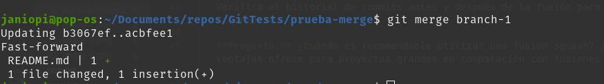
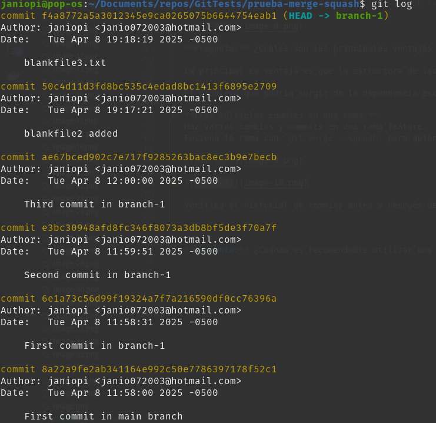
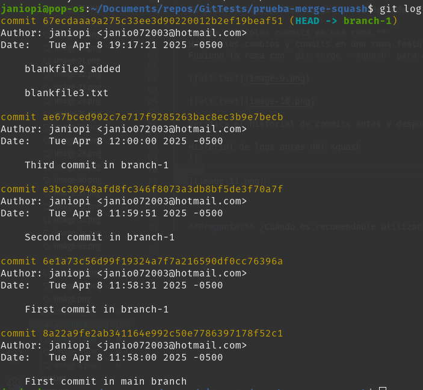
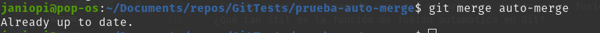

# Ejercicios

#### Ejercicios

1. **Clona un repositorio Git con múltiples ramas.**  
   Identifica dos ramas que puedas fusionar utilizando `git merge --ff`.

   

   branch-1

   

   master

   

   Haz el proceso de fusión utilizando `git merge --ff`.  
   Verifica el historial con `git log --graph --oneline`.

   Fusionaremos las ramas branch-1 y master

   Antes del merge
   

   Haciendo el merge
   

   Luego del merge

   

   **Pregunta:** ¿En qué situaciones recomendarías evitar el uso de `git merge --ff`? Reflexiona sobre las desventajas de este método.

   Recomendaría evitar utilizar el git merge -ff en caso que se quiera mantener el historial de ramas. Una vez ejecutado el merge -ff, la rama fusionada se pierde completamente.

2. **Simula un flujo de trabajo de equipo.**  
   Trabaja en dos ramas independientes, creando diferentes cambios en cada una.

   

   Fusiona ambas ramas con `git merge --no-ff` para ver cómo se crean los commits de fusión.

   
   Observa el historial utilizando `git log --graph --oneline`.

   

   **Pregunta:** ¿Cuáles son las principales ventajas de utilizar `git merge --no-ff` en un proyecto en equipo? ¿Qué problemas podrían surgir al depender excesivamente de commits de fusión?

   La principal es ventaja es que la estructura de las ramas se mantiene, en comparación con el merge fast forward.

   El problema que podría surgir de la dependencia excesiva de commits de fusión, sería que el historial se muestre bastante "desordenado", con tantas ramas y sea difícil entender el flujo de manera sencilla.

3. **Crea múltiples commits en una rama.**  
   Haz varios cambios y commits en una rama feature.  
   Fusiona la rama con `git merge --squash` para aplanar todos los commits en uno solo.

   

   

   Verifica el historial de commits antes y después de la fusión para ver la diferencia.

   Historial de logs antes del squash
   

   Luego del squash

   

   **Pregunta:** ¿Cuándo es recomendable utilizar una fusión squash? ¿Qué ventajas ofrece para proyectos grandes en comparación con fusiones estándar?

   Es recomendable utilizar squash cuando se quieren "agrupar" mútliples commits en el historial.

   Permite mantener un historial mucho más limpio y compacto.

#### Resolver conflictos en una fusión non-fast-forward

En algunos casos, las fusiones no son tan sencillas y pueden surgir conflictos que necesitas resolver manualmente. Este ejercicio te guiará a través del proceso de manejo de conflictos.

1. Inicializa un nuevo repositorio:

   ```bash
   mkdir prueba-merge-conflict
   cd prueba-merge-conflict
   git init
   ```

   

2. Crea un archivo index.html y realiza un commit en la rama main:

   ```bash
   echo "<html><body><h1>Proyecto inicial CC3S2</h1></body></html>" > index.html
   git add index.html
   git commit -m "commit inicial del  index.html en main"
   ```

   

3. Crea y cambia a una nueva rama feature-update:

   ```bash
   git checkout -b feature-update
   ```

   

4. Edita el archivo y realiza un commit en la rama feature-update:

   ```bash
   echo "<p>.....</p>" >> index.html
   git add index.html
   git commit -m "Actualiza ..."
   ```

   

5. Regresa a la rama main y realiza una edición en el mismo archivo:

   ```bash
   git checkout main
   echo "<footer>Contacta aquí example@example.com</footer>" >> index.html
   git add index.html
   git commit -m "....index.html"
   ```

   

6. Fusiona la rama feature-update con --no-ff y observa el conflicto:

   ```bash
   git merge --no-ff feature-update
   ```

   

7. Git detectará un conflicto en index.html. Abre el archivo y resuelve el conflicto. Elimina las líneas de conflicto generadas por Git (`<<<<<<<`, `=======`, `>>>>>>>`) y crea la versión final del archivo con ambos cambios:

   ```html
   <html>
     <body>
       <h1>....</h1>
       <p>....</p>
       <footer>...example@example.com</footer>
     </body>
   </html>
   ```

   

8. Agrega el archivo corregido y completa la fusión:

   ```bash
   git add index.html
   git commit
   ```

   

9. Verifica el historial para confirmar la fusión y el commit de resolución de conflicto:
   ```bash
   git log --graph --oneline
   ```
   
   **Preguntas:**

- ¿Qué pasos adicionales tuviste que tomar para resolver el conflicto?
  Tuvimos que modificar manualmente el index.html para resolver el conflicto
- ¿Qué estrategias podrías emplear para evitar conflictos en futuros desarrollos colaborativos?

  Comunicar los cambios realizados en los archivos y evitar realizar cambios conflictivos(por ejemplo modificar las mismas líneas)

#### Ejercicio: Comparar los historiales con git log después de diferentes fusiones

Este ejercicio te permitirá observar las diferencias en el historial generado por fusiones fast-forward, non-fast-forward y squash.

##### Pasos

1. Crea un nuevo repositorio y realiza varios commits en dos ramas:

   ```bash
   mkdir prueba-compare-merge
   cd prueba-compare-merge
   git init
   echo "Version 1.0" > version.txt
   git add version.txt
   git commit -m "...."
   git checkout -b feature-1
   echo "Caracteristica 1 agregada" >> version.txt
   git add version.txt
   git commit -m "Agregar caracteristica 1"
   git checkout main
   git checkout -b feature-2
   echo "Caracteristica 2 agregada" >> version.txt
   git add version.txt
   git commit -m "Se agrega caracteristica 2"
   ```

   

2. Fusiona feature-1 usando fast-forward:

   ```bash
   git checkout main
   git merge feature-1 --ff
   ```

   

3. Fusiona feature-2 usando non-fast-forward:

   ```bash
   git merge feature-2 --no-ff
   ```

   

4. Realiza una nueva rama feature-3 con múltiples commits y fusiónala con squash:

   ```bash
   git checkout -b feature-3
   echo "Caracteristica 3 paso 1" >> version.txt
   git add version.txt
   git commit -m "Caracteristica 3 paso 1"
   echo "Caracteristica 3 paso 2" >> version.txt
   git add version.txt
   git commit -m "Caracteristica 3 paso 2"
   git checkout main
   git merge --squash feature-3
   git commit -m "Agregar caracteristica 3 en un commit"
   ```

   

5. Compara el historial de Git:

   - Historial Fast-forward:

     ```bash
     git log --graph --oneline --merges --first-parent –branches
     ```

     

   - Historial Non-fast-forward:

     ```bash
     git log --graph --oneline –merges
     ```

     

   - Historial con Squash:

     ```bash
     git log --graph --oneline --merges --decorate --all
     ```

     

**Preguntas:**

- ¿Cómo se ve el historial en cada tipo de fusión?
  Los historiales se ven lineales
- ¿Qué método prefieres en diferentes escenarios y por qué?

  Fast Forward: Se quiere un historial lineales

  No Fast Forward: Se quiere mantener la estrucutra de las ramas

  Squash: Se quieren juntar varios commits en uno solo

#### Ejercicio: Usando fusiones automáticas y revertir fusiones

En este ejercicio, aprenderás cómo Git puede fusionar automáticamente cambios cuando no hay conflictos y cómo revertir una fusión si cometes un error.

##### Pasos

1. Inicializa un nuevo repositorio y realiza dos commits en main:

   ```bash
   mkdir prueba-auto-merge
   cd prueba-auto-merge
   git init
   echo "Linea 1" > file.txt
   git add file.txt
   git commit -m "Agrega linea 1"
   echo "Linea 2" >> file.txt
   git add file.txt
   git commit -m "...linea 2"
   ```

   

2. Crea una nueva rama auto-merge y realiza otro commit en file.txt:

   ```bash
   git checkout -b auto-merge
   echo "Linea 3" >> file.txt
   git add file.txt
   git commit -m "... linea 3"
   ```

   

3. Vuelve a main y realiza cambios no conflictivos en otra parte del archivo:

   ```bash
   git checkout main
   echo "Footer: Fin del archivo" >> file.txt
   git add file.txt
   git commit -m "Add footer al archivo file.txt"
   ```

   

4. Fusiona la rama auto-merge con main:

   ```bash
   git merge auto-merge
   ```

   

5. Git debería fusionar los cambios automáticamente sin conflictos.

6. Revertir la fusión: Si decides que la fusión fue un error, puedes revertirla:

   ```bash
   git revert -m 1 HEAD
   ```

   

7. Verifica el historial:

   ```bash
   git log --graph --oneline
   ```

   

**Preguntas:**

- ¿Cuándo usarías un comando como git revert para deshacer una fusión?

  En caso ya se ha realizado otros cambios después de la fusión y no deseas perder todo el trabajo posterior

- ¿Qué tan útil es la función de fusión automática en Git?

  La fusión automática es extremadamente útil y eficaz, pero es importante revisarla cuando se presenten conflictos o cuando la lógica de la fusión pueda ser complicada.

#### Ejercicio: Fusión remota en un repositorio colaborativo

Este ejercicio te permitirá practicar la fusión de ramas en un entorno remoto colaborativo, simulando un flujo de trabajo de equipo.

##### Pasos:

1. Clona un repositorio remoto desde GitHub o crea uno nuevo:

   ```bash
   git clone https://github.com/tu-usuario/nombre-del-repositorio.git
   cd nombre-del-repositorio
   ```

   

2. Crea una nueva rama colaboracion y haz algunos cambios:

   ```bash
   git checkout -b colaboracion
   echo "Colaboración remota" > colaboracion.txt
   git add colaboracion.txt
   git commit -m "...."
   ```

   

3. Empuja los cambios a la rama remota:

   ```bash
   git push origin colaboracion
   ```

   

4. Simula una fusión desde la rama colaboracion en la rama main de otro colaborador. (Puedes usar la interfaz de GitHub para crear un Pull Request y realizar la fusión).

   

**Preguntas:**

- ¿Cómo cambia la estrategia de fusión cuando colaboras con otras personas en un repositorio remoto?

  Mediante las pull requests, se fomenta un ambiente colaborativo, donde se discuten los cambios a realizar.

- ¿Qué problemas comunes pueden surgir al integrar ramas remotas?

  Dichas ramas pueden contener errores, transimitiéndolos a la rama main cuando son fusionadas

#### Ejercicio final: flujo de trabajo completo

Configura un proyecto simulado:

- Crea un proyecto con tres ramas: main, feature1, y feature2.
- Realiza varios cambios en feature1 y feature2 y simula colaboraciones paralelas.
- Realiza fusiones utilizando diferentes métodos:
  - Fusiona feature1 con main utilizando `git merge --ff`.
  - Fusiona feature2 con main utilizando `git merge --no-ff`.
  - Haz una rama adicional llamada feature3 y aplasta sus commits utilizando `git merge --squash`.

Analiza el historial de commits:

- Revisa el historial para entender cómo los diferentes métodos de fusión afectan el árbol de commits.
- Compara los resultados y discute con tus compañeros de equipo cuál sería la mejor estrategia de fusión para proyectos más grandes.
