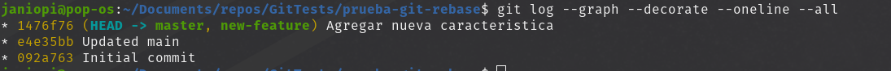
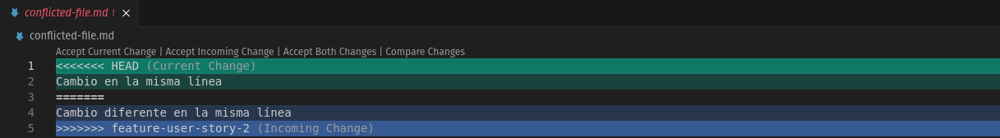
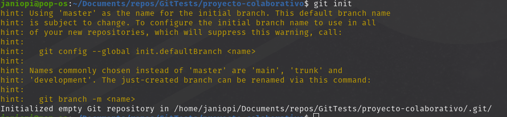

## **Actividad: Rebase, Cherry-Pick y CI/CD en un entorno ágil**

### Objetivo de aprendizaje:

Aprender a usar los comandos `git rebase` y `git cherry-pick` para mantener un historial de commits limpio y manejable en proyectos colaborativos. También explorarás cuándo y por qué utilizar estos comandos en lugar de los merges regulares.

#### **Parte 1: git rebase para mantener un historial lineal**

1. **Introducción a Rebase:**

   El rebase mueve tus commits a una nueva base, dándote un historial lineal y limpio. En lugar de fusionar ramas y mostrar un "commit de merge", el rebase integra los cambios aplicándolos en la parte superior de otra rama.

   - **Caso de uso**: Simplifica la depuración y facilita la comprensión del historial de commits.

2. **Escenario de ejemplo:**

   - Crea un nuevo repositorio Git y dos ramas, main y new-feature:
     

   - Crea y cambia a la rama new-feature:
     

     **Pregunta:** Presenta el historial de ramas obtenida hasta el momento.
     

   Ahora, digamos que se han agregado nuevos commits a main mientras trabajabas en new-feature:
   

   Tu gráfico de commits ahora diverge (comprueba esto)
   

   > **Tarea**: Realiza el rebase de `new-feature` sobre `main` con los siguientes comandos:
   > 

3. **Revisión:**

   Después de realizar el rebase, visualiza el historial de commits con:
   

4. **Momento de fusionar y completar el proceso de git rebase:**
   
   Cuando se realiza una fusión _fast-forward_, las HEADs de las ramas main y new-feature serán los commits correspondientes.

#### Parte 2: **git cherry-pick para la integración selectiva de commit**

1. **Introducción a Cherry-pick:**

   `git cherry-pick` te permite seleccionar commits individuales de una rama y aplicarlos en otra. Esto es útil cuando necesitas integrar una característica o corrección sin hacer merge de toda la rama.

   Imagina que tienes dos ramas, main y feature. Te das cuenta de que uno o dos commits de la rama feature deberían moverse a main, pero no estás listo para fusionar toda la rama. El comando `git cherry-pick` te permite hacer precisamente eso.

   Puedes hacer cherry-pick de los cambios de un commit específico en la rama feature y aplicarlos en la rama main.
   Esta acción creará un nuevo commit en la rama main.

2. **Escenario de ejemplo:**

   ```bash
   # Inicializar un nuevo repositorio
   $ mkdir prueba-cherry-pick
   $ cd prueba-cherry-pick
   $ git init

   # Agregar y commitear README.md inicial a main
   $ echo "# Mi Projecto" > README.md
   $ git add README.md
   $ git commit -m "Commit inicial"

   # Crear y cambiar a una nueva rama 'add-base-documents'
   $ git checkout -b add-base-documents

   # Hacer cambios y commitearlos
   # Agregar CONTRIBUTING.md
   $ echo "# CONTRIBUTING" >> CONTRIBUTING.md
   $ git add CONTRIBUTING.md
   $ git commit -m "Se agrega CONTRIBUTING.md"

   # Agregar LICENSE.txt
   $ echo "LICENSE" >> LICENSE.txt
   $ git add LICENSE.txt
   $ git commit -m "Agrega LICENSE.txt"

   # Echa un vistazo al log de la rama 'add-base-documents'
   $ git log add-base-documents --graph --oneline
   ```

   - Inicializamos el proyecto
     
   - Primer commit en main/master
     
   - Crear y cambiar a nueva rama 'add-base-documents'
     
   - Hacer cambios y commitearlos
     

   **Pregunta:** Muestra un diagrama de como se ven las ramas en este paso.
   

3. **Tarea: Haz cherry-pick de un commit de add-base-documents a main:**
   

4. **Revisión:**  
   Revisa el historial nuevamente:
   

   Después de que hayas realizado con éxito el cherry-pick del commit, se agregará un nuevo commit a tu rama actual (main en este ejemplo) y contendrá los cambios del commit cherry-picked.

   Ten en cuenta que el nuevo commit tiene los mismos cambios pero un valor de hash de commit diferente.

##### **Preguntas de discusión:**

1. ¿Por qué se considera que rebase es más útil para mantener un historial de proyecto lineal en comparación con merge?

- Git rebase reescribe el historial de commits colocando los cambios de una rama "encima" de otra, como si hubieran sido desarrollados secuencialmente. Esto elimina los "divergentes" que aparecen en el historial con git merge, que preserva la estructura de bifurcación.

2. ¿Qué problemas potenciales podrían surgir si haces rebase en una rama compartida con otros miembros del equipo?

- Hacer rebase en una rama compartida reescribe el historial, lo que puede causar conflictos con otros desarrolladores que ya hayan descargado (pulled) esa rama.

3. ¿En qué se diferencia cherry-pick de merge, y en qué situaciones preferirías uno sobre el otro?
   - Se prefiere utilizar el cherry-pick sobre el merge cuando solo se quiere aplicar un cambio(commit) específico de una rama a otra. En el caso del merge, cuando se quiere aplicar todos los commits.
4. ¿Por qué es importante evitar hacer rebase en ramas públicas?
   - Para evitar reescribir el historial de commits. Si una rama ya fue compartida (pushed), y haces rebase, estarás cambiando ese historia

#### **Ejercicios teóricos**

1. **Diferencias entre git merge y git rebase**  
   **Pregunta**: Explica la diferencia entre git merge y git rebase y describe en qué escenarios sería más adecuado utilizar cada uno en un equipo de desarrollo ágil que sigue las prácticas de Scrum.

   - Merge es ideal durante revisiones de código o integración de funcionalidades al final del sprint, ya que preserva el contexto y la trazabilidad del trabajo en ramas específicas.

   - Rebase se usa antes de un pull request o durante el desarrollo en ramas personales, para mantener un historial limpio , ideal para revisar cambios antes de fusionarlos.

2. **Relación entre git rebase y DevOps**  
   **Pregunta**: ¿Cómo crees que el uso de git rebase ayuda a mejorar las prácticas de DevOps, especialmente en la implementación continua (CI/CD)? Discute los beneficios de mantener un historial lineal en el contexto de una entrega continua de código y la automatización de pipelines.

   - Git rebase apoya la estabilidad de los pipelines DevOps al reducir conflictos, mejorar la trazabilidad de cambios y permitir flujos de integración más claros y automatizados.

3. **Impacto del git cherry-pick en un equipo Scrum**  
   **Pregunta**: Un equipo Scrum ha finalizado un sprint, pero durante la integración final a la rama principal (main) descubren que solo algunos commits específicos de la rama de una funcionalidad deben aplicarse a producción. ¿Cómo podría ayudar git cherry-pick en este caso? Explica los beneficios y posibles complicaciones.
   - Git cherry-pick permitiría seleccionar solo ese commit específico de la rama "develop" para aplicarlo a la rama main.
   - Beneficio: Precisión(Solo se aplican los cambios necesarios)
   - Complicacion: Conflictos si los commits seleccionados dependen de otros que no fueron cherry-picked.

#### **Ejercicios prácticos**

1.  **Simulación de un flujo de trabajo Scrum con git rebase y git merge**

    **Contexto:**  
    Tienes una rama `main` y una rama `feature` en la que trabajas. Durante el desarrollo del sprint, se han realizado commits tanto en `main` como en `feature`.

    Tu objetivo es integrar los cambios de la rama `feature` en `main` manteniendo un historial limpio.

    **Instrucciones:**

    - Crea un repositorio y haz algunos commits en la rama main.
      
    - Crea una rama feature, agrega nuevos commits, y luego realiza algunos commits adicionales en main.
      

      

    - Realiza un rebase de feature sobre main.
      
    - Finalmente, realiza una fusión fast-forward de feature con main.
      

    **Preguntas:**

    - ¿Qué sucede con el historial de commits después del rebase?
    - Obtenemos un historial lineal de commits
      
    - ¿En qué situación aplicarías una fusión fast-forward en un proyecto ágil?
      - En caso que la rama de destino (ej develop) no haya avanzado desde la creación de la rama de trabajo (ej feature/1). Al terminar el desarrollador podría hacer rebase para limpiar el historial y luego un merge ff.

2.  **Cherry-pick para integración selectiva en un pipeline CI/CD**

        **Contexto:**
        Durante el desarrollo de una funcionalidad, te das cuenta de que solo ciertos cambios deben ser integrados en la rama de producción, ya que el resto aún está en desarrollo. Para evitar fusionar toda la rama, decides hacer cherry-pick de los commits que ya están listos para producción.

        **Instrucciones:**

        - Crea un repositorio con una rama main y una rama feature.
            
            

        - Haz varios commits en la rama feature, pero solo selecciona uno o dos commits específicos que consideres listos para producción.
            

        - Realiza un cherry-pick de esos commits desde feature a main.
            

        - Verifica que los commits cherry-picked aparezcan en main.
            

        **Preguntas:**

        - ¿Cómo utilizarías cherry-pick en un pipeline de CI/CD para mover solo ciertos cambios listos a producción?

        En un entorno CI/CD, utilizaría git cherry-pick cuando:

        Se han completado varios cambios en una rama (por ejemplo, develop o feature-x).

        Solo algunos de esos cambios están completamente validados (por pruebas, QA, revisión, etc.) y deben moverse a la rama main o release para producción.

        No se desea hacer un merge completo porque el resto del trabajo está incompleto o no aprobado.
        - ¿Qué ventajas ofrece cherry-pick en un flujo de trabajo de DevOps?

        Precisión(Solo se aplican los cambios necesarios)

        Agilidad para hotfixes y entregas parciales:

    Puedes mover solo un fix urgente a producción sin esperar al cierre de todo el sprint o rama.

        Flexibilidad sin romper el flujo:No altera el resto del historial ni interfiere con ramas en curso

#### **Git, Scrum y Sprints**

#### **Fase 1: Planificación del sprint (sprint planning)**

**Ejercicio 1: Crear ramas de funcionalidades (feature branches)**

En esta fase del sprint, los equipos Scrum deciden qué historias de usuario van a trabajar. Cada historia de usuario puede representarse como una rama de funcionalidad.

**Objetivo:** Crear ramas para cada historia de usuario y asegurar que el trabajo se mantenga aislado.

**Instrucciones:**

1. Crea un repositorio en Git.
2. Crea una rama `main` donde estará el código base.
3. Crea una rama por cada historia de usuario asignada al sprint, partiendo de la rama `main`.

**Comandos:**


**Pregunta:** ¿Por qué es importante trabajar en ramas de funcionalidades separadas durante un sprint?

- Para agilizar el desarrollo del proyecto. (Mútliples integrantes pueden avanzar con diferentes "aspectos" del proyecto al mismo tiempo)
- Evitar conflictos al trabajar en paralelo. Como cada aspecto se trabaja en una rama diferente, la integridad ramas principales (como main) no se ve comprometida.

#### **Fase 2: Desarrollo del sprint (sprint execution)**

**Ejercicio 2: Integración continua con git rebase**

A medida que los desarrolladores trabajan en sus respectivas historias de usuario, pueden ocurrir cambios en main. Para mantener un historial lineal y evitar conflictos más adelante, se usa `git rebase` para integrar los últimos cambios de main en las ramas de funcionalidad antes de finalizar el sprint.

**Objetivo:** Mantener el código de la rama de funcionalidad actualizado con los últimos cambios de main durante el sprint.

**Instrucciones:**

1. Haz algunos commgitits en main.
2. Realiza un rebase de la rama `feature-user-story-1` para actualizar su base con los últimos cambios de main.

**Comandos:**

```bash
# Simula cambios en la rama main
$ git checkout main
$ echo "Actualización en main" > updates.md
$ git add updates.md
$ git commit -m "Actualizar main con nuevas funcionalidades"

# Rebase de la rama feature-user-story-1 sobre main
$ git checkout feature-user-story-1
$ git rebase main
```


**Pregunta:** ¿Qué ventajas proporciona el rebase durante el desarrollo de un sprint en términos de integración continua?

    - Historial lineal y ordenado: Rebase elimina la ramificación visual del historial, reescribiendo los commits encima de la rama base (por ejemplo, main o develop). Esto facilita la lectura del historial, revisión de cambios y auditoría de errores en los pipelines CI
    - Reducción de conflictos al integrar:Al rebasar una rama de funcionalidad con frecuencia sobre develop, los conflictos se detectan y resuelven antes de hacer el merge final. Esto reduce la posibilidad de conflictos masivos durante la integración de último momento.
    - Facilita despliegues automáticos (CD): Un historial limpio y sin múltiples ramas anidadas reduce el riesgo de errores en los scripts de despliegue automático, facilitando la entrega continua

#### **Fase 3: Revisión del sprint (sprint review)**

**Ejercicio 3: Integración selectiva con git cherry-pick**

En esta fase, es posible que algunas funcionalidades estén listas para ser mostradas a los stakeholders, pero otras aún no están completamente implementadas. Usar `git cherry-pick` puede permitirte seleccionar commits específicos para mostrar las funcionalidades listas, sin hacer merge de ramas incompletas.

**Objetivo:** Mover commits seleccionados de una rama de funcionalidad (`feature-user-story-2`) a `main` sin integrar todos los cambios.

**Instrucciones:**

1. Realiza algunos commits en `feature-user-story-2`.
2. Haz cherry-pick de los commits que estén listos para mostrarse a los stakeholders durante la revisión del sprint.

**Comandos:**

```bash
$ git checkout feature-user-story-2
$ echo "Funcionalidad lista" > feature2.md
$ git add feature2.md
$ git commit -m "Funcionalidad lista para revisión"

$ echo "Funcionalidad en progreso" > progress.md
$ git add progress.md
$ git commit -m "Funcionalidad aún en progreso"

# Ahora selecciona solo el commit que esté listo
$ git checkout main
$ git cherry-pick <hash_del_commit_de_feature-lista>

```


**Pregunta:** ¿Cómo ayuda `git cherry-pick` a mostrar avances de forma selectiva en un sprint review?

- En este caso, cherry-pick nos permite escoger commits donde ciertas funcionalidades ya se encuentran listas para revisión.
- Es decir, es ideal para separar código que está listo de aquel que aún necesita más trabajo o revisión.

#### **Fase 4: Retrospectiva del sprint (sprint retrospective)**

**Ejercicio 4: Revisión de conflictos y resolución**

Durante un sprint, pueden surgir conflictos al intentar integrar diferentes ramas de funcionalidades. Es importante aprender cómo resolver estos conflictos y discutirlos en la retrospectiva.

**Objetivo:** Identificar y resolver conflictos de fusión con `git merge` al intentar integrar varias ramas de funcionalidades al final del sprint.

**Instrucciones:**

1. Realiza cambios en `feature-user-story-1` y `feature-user-story-2` que resulten en conflictos.
2. Intenta hacer merge de ambas ramas con main y resuelve los conflictos.

**Comandos:**

```bash
$ git checkout feature-user-story-1
$ echo "Cambio en la misma línea" > conflicted-file.md
$ git add conflicted-file.md
$ git commit -m "Cambio en feature 1"

$ git checkout feature-user-story-2
$ echo "Cambio diferente en la misma línea" > conflicted-file.md
$ git add conflicted-file.md
$ git commit -m "Cambio en feature 2"

# Intentar hacer merge en main
$ git checkout main
$ git merge feature-user-story-1
$ git merge feature-user-story-2
```


Intentado hacer merge

Se presenta un conflicto en `conflicted-file.md`

Solucionando el conflicto (Nos quedamos con la versión inicial de conflicted-file.md)


**Pregunta**: ¿Cómo manejas los conflictos de fusión al final de un sprint? ¿Cómo puede el equipo mejorar la comunicación para evitar conflictos grandes?

- En los archivos "conflictivos", tenemos que escoger con que versión "quedarnos". (Ya sea el Current Change o Incoming change o incluso combinar ambas)
- Para evitar conflictos grandes, los equipos de desarrollo tienen que ponerse de acuerdo con que versión de archivos se busca trabajar, mantener las ramas de desarrollo sincronizada con cambios recientes.

#### **Fase 5: Fase de desarrollo, automatización de integración continua (CI) con git rebase**

**Ejercicio 5: Automatización de rebase con hooks de Git**

En un entorno CI, es común automatizar ciertas operaciones de Git para asegurar que el código se mantenga limpio antes de que pase a la siguiente fase del pipeline. Usa los hooks de Git para automatizar el rebase cada vez que se haga un push a una rama de funcionalidad.

**Objetivo:** Implementar un hook que haga automáticamente un rebase de `main` antes de hacer push en una rama de funcionalidad, asegurando que el historial se mantenga limpio.

**Instrucciones:**

1. Configura un hook `pre-push` que haga un rebase automático de la rama `main` sobre la rama de funcionalidad antes de que el push sea exitoso.
2. Prueba el hook haciendo push de algunos cambios en la rama `feature-user-story-1`.

**Comandos:**

```bash
# Dentro de tu proyecto, crea un hook pre-push
$ nano .git/hooks/pre-push

# Agrega el siguiente script para automatizar el rebase
#!/bin/bash
git fetch origin main
git rebase origin/main

# Haz el archivo ejecutable
$ chmod +x .git/hooks/pre-push

# Simula cambios y haz push
$ git checkout feature-user-story-1
$ echo "Cambios importantes" > feature1.md
$ git add feature1.md
$ git commit -m "Cambios importantes en feature 1"
$ git push origin feature-user-story-1
```

Creando el script


Haciendolo ejecutable


Simulando cambios


(En este caso, el repositorio sobre el cual estabamos trabajando es local, por lo que obtenemos error cuando hacemos el push(`Could not find remote repository`). Bastaría conectar a un repositorio real, con `git remote add origin`. Haríamos push nuevamente y se activaría el trigger )

**Pregunta**: ¿Qué ventajas y desventajas observas al automatizar el rebase en un entorno de CI/CD?

- Ventajas:
  - Historial limpio y lineal: Automatizar el rebase asegura que todas las ramas de trabajo estén siempre actualizadas respecto a la rama base (main o develop), manteniendo un historial fácil de leer.
  - Reducción en conflictos tardíos: Al aplicar rebase frecuente, los conflictos se detectan temprano y no se acumulan hasta el final del sprint o al hacer merge.
  - Facilita revisiones: Un historial limpio mejora la legibilidad en pull requests y reduce errores en scripts de despliegue automático.
- Desventajas: - Dificultad para depurar errores: Si un rebase falla por un conflicto y se automatizó sin revisión manual, puede dejar la rama en estado inconsistente o difícil de reparar.
  - Reescritura de historial automatizada: Rebase reescribe el historial de la rama. Automatizarlo puede sobrescribir o corromper commits si no se maneja con extremo cuidado.
  - Requiere configuración segura y muy controlada: Automatizar operaciones destructivas como rebase requiere validaciones, backups y revisiones de permisos, especialmente si se ejecuta sobre ramas protegidas.

---

### **Navegando conflictos y versionado en un entorno devOps**

**Objetivo:**  
Gestionar conflictos en Git, realizar fusiones complejas, utilizar herramientas para comparar y resolver conflictos, aplicar buenas prácticas en el manejo del historial de versiones y usar el versionado semántico en un entorno de integración continua (CI).

**Herramientas:**

- Git
- Un entorno de desarrollo (Visual Studio Code, terminal, etc.)
- Un repositorio en GitHub o GitLab (opcional, puede ser local)

**Contexto:**  
En un entorno de desarrollo colaborativo, los conflictos son inevitables cuando varios desarrolladores trabajan en la misma base de código. Resolver estos conflictos es crucial para mantener un flujo de trabajo eficiente en DevOps.

Los conflictos ocurren cuando dos ramas modifican la misma línea de un archivo y luego se intenta fusionarlas. Git no puede decidir qué cambio priorizar, por lo que la resolución manual es necesaria.

#### **Cómo fusionar conflictos en Git:**

1. **Identificar conflictos**: Usa `git status` para ver los archivos en conflicto.
2. **Examinar los archivos**: Busca los marcadores de conflicto (`<<<<<<<`, `=======`, `>>>>>>`) en los archivos.
3. **Resolver los conflictos**: Elige qué cambios conservar (rama actual o fusionada) o mezcla ambos.
4. **Commit de los archivos resueltos**: Después de resolver, añade los archivos al staging y realiza el commit.

#### **Comandos para resolver conflictos**

- `git checkout --ours <file-path>`: Conserva los cambios de tu rama.
- `git checkout --theirs <file-path>`: Conserva los cambios de la rama fusionada.

#### **Herramientas para gestionar fusiones**

- `git diff`: Compara las diferencias entre dos ramas o commits, ayudando a identificar conflictos:

  ```bash
  $ git diff feature-branch..main
  ```

- `git merge --no-commit --no-ff`: Simula una fusión sin realizar el commit para ver los cambios:

  ```bash
  $ git merge --no-commit --no-ff feature-branch
  $ git diff --cached
  ```

  Si no es lo que esperas, puedes abortar la fusión:

  ```bash
  $ git merge --abort
  ```

- `git mergetool`: Usa herramientas gráficas para resolver conflictos de manera visual. Configura tu herramienta preferida:
  ```bash
  $ git config --global merge.tool vimdiff
  $ git mergetool
  ```

##### **Comandos para organizar tu entorno de trabajo**

- **git reset**: Este comando permite retroceder en el historial de commits. Existen tres tipos:

  1. **Soft Reset**: Mueve el HEAD sin cambiar los archivos:
     ```bash
     $ git reset --soft <commit>
     ```
  2. **Mixed Reset**: Mueve el HEAD y quita archivos del staging, pero mantiene los cambios:
     ```bash
     $ git reset --mixed <commit>
     ```
  3. **Hard Reset**: Elimina todos los cambios no guardados y resetea el directorio de trabajo:
     ```bash
     $ git reset --hard <commit>
     ```

- **git revert**: Deshace cambios sin modificar el historial de commits, creando un nuevo commit:

  ```bash
  $ git revert <commit_hash>
  ```

- **git checkout**: Además de cambiar de ramas, este comando te permite restaurar archivos específicos:
  ```bash
  $ git checkout -- <file_name>
  ```

##### **Herramientas para depurar**

- **git blame**: Muestra qué usuario hizo cambios en una línea específica de un archivo:

  ```bash
  $ git blame file.txt
  ```

- **git bisect**: Realiza una búsqueda binaria para encontrar el commit que introdujo un error:
  ```bash
  $ git bisect start
  $ git bisect bad
  $ git bisect good <commit>
  $ git bisect reset
  ```

##### **git clean y stash**

1. `git clean`: Elimina archivos y directorios no rastreados.

   ```bash
   $ git clean -fd
   ```

2. `git stash`: Guarda cambios sin hacer commit, útil para multitasking.
   ```bash
   $ git stash
   $ git stash apply stash@{0}
   ```

##### **.gitignore**

El archivo `.gitignore` te permite especificar qué archivos y carpetas deben ignorarse durante un `git add`, asegurando que permanezcan exclusivos de tu entorno local.

```bash
# Ignorar todos los archivos de log
.log

# Ignorar archivos de configuración personal
config/personal/
```

##### **Versioning en Git**

Usa versioning semántico para gestionar versiones del software de manera clara:

```bash
$ git tag -a v1.0 -m "Initial stable release"
$ git tag v2.4.4 <commit>
```

---

#### **Ejemplo:**

1. **Inicialización del proyecto y creación de ramas**

   - **Paso 1**: Crea un nuevo proyecto en tu máquina local.

     ```bash
     $ mkdir proyecto-colaborativo
     $ cd proyecto-colaborativo
     ```

     

   - **Paso 2**: Inicializa Git en tu proyecto.

     ```bash
     $ git init
     ```

     

   - **Paso 3**: Crea un archivo de texto llamado `archivo_colaborativo.txt` y agrega algún contenido inicial.

     ```bash
     $ echo "Este es el contenido inicial del proyecto" > archivo_colaborativo.txt
     ```

     

   - **Paso 4**: Agrega el archivo al área de staging y haz el primer commit.

     ```bash
     $ git add .
     $ git commit -m "Commit inicial con contenido base"
     ```

     

   - **Paso 5**: Crea dos ramas activas: main y feature-branch.

     ```bash
     $ git branch feature-branch  # Crear una nueva rama
     ```

     

   - **Paso 6**: Haz checkout a la rama feature-branch y realiza un cambio en el archivo `archivo_colaborativo.txt`.

     ```bash
     $ git checkout feature-branch
     $ echo "Este es un cambio en la feature-branch" >> archivo_colaborativo.txt
     $ git add .
     $ git commit -m "Cambios en feature-branch"
     ```

     

   - **Paso 7**: Regresa a la rama main y realiza otro cambio en la misma línea del archivo `archivo_colaborativo.txt`.

     ```bash
     $ git checkout main
     $ echo "Este es un cambio en la rama main" >> archivo_colaborativo.txt
     $ git add .
     $ git commit -m "Cambios en main"
     ```

     

2. **Fusión y resolución de conflictos**

   - **Paso 1**: Intenta fusionar feature-branch en main. Se espera que surjan conflictos de fusión.
     ```bash
     $ git merge feature-branch
     ```
     
   - **Paso 2**: Usa `git status` para identificar los archivos en conflicto. Examina los archivos afectados y resuelve manualmente los conflictos, conservando las líneas de código más relevantes para el proyecto.

     ```bash
     $ git status
     $ git checkout --theirs <archivo>  # Si decides aceptar los cambios de feature-branch
     $ git checkout --ours <archivo>    # Si decides aceptar los cambios de main
     ```

     
     Aceptaremos los cambios de main
     

   - **Paso 3**: Una vez resueltos los conflictos, commitea los archivos y termina la fusión
     ```bash
     $ git add .
     $ git commit -m "Conflictos resueltos"
     ```
     

3. **Simulación de fusiones y uso de git diff**

   - **Paso 1**: Simula una fusión usando `git merge --no-commit --no-ff` para ver cómo se comportarían los cambios antes de realizar el commit.

     ```bash
     $ git merge --no-commit --no-ff feature-branch
     $ git diff --cached  # Ver los cambios en el área de staging
     $ git merge --abort  # Abortar la fusión si no es lo que se esperaba
     ```

     

     

   

4. **Uso de git mergetool**

   - **Paso 1**: Configura git mergetool con una herramienta de fusión visual (puedes usar meld, vimdiff, o Visual Studio Code).
     ```bash
     $ git config --global merge.tool <nombre-herramienta>
     $ git mergetool
     ```

   

   - **Paso 2**: Usa la herramienta gráfica para resolver un conflicto de fusión.

   

5. **Uso de git revert y git reset**

   - **Paso 1**: Simula la necesidad de revertir un commit en main debido a un error. Usa `git revert` para crear un commit que deshaga los cambios.

     ```bash
     $ git revert <commit_hash>
     ```

     Historial de commits antes del revert
     

     Luego del revert
     

   - **Paso 2**: Realiza una prueba con `git reset --mixed` para entender cómo reestructurar el historial de commits sin perder los cambios no commiteados.

     ```bash
     $ git reset --mixed <commit_hash>
     ```

     Simulando un cambio
     

     Historial antes del reset --mixed
     

   Luego del reset
   

6. **Versionado semántico y etiquetado**

   - **Paso 1**: Aplica versionado semántico al proyecto utilizando tags para marcar versiones importantes.
     ```bash
     $ git tag -a v1.0.0 -m "Primera versión estable"
     $ git push origin v1.0.0
     ```
     

   (Como se mencionó anteriormente,este error ocurre debido a que el repositorio de prueba es local)

7. **Aplicación de git bisect para depuración**

   - **Paso 1**: Usa `git bisect` para identificar el commit que introdujo un error en el código.

     ```bash
     $ git bisect start
     $ git bisect bad   # Indica que la versión actual tiene un error
     $ git bisect good <último_commit_bueno>
     # Continúa marcando como "good" o "bad" hasta encontrar el commit que introdujo el error
     $ git bisect reset  # Salir del modo bisect
     ```

     (Se puede observar el tag en el commit correspondiente)
     

     (Se puede observar los commits marcados como bad o good)
     

     Reseteando
     

#### **Preguntas**

1. **Ejercicio para git checkout --ours y git checkout --theirs**

   **Contexto**: En un sprint ágil, dos equipos están trabajando en diferentes ramas. Se produce un conflicto de fusión en un archivo de configuración crucial. El equipo A quiere mantener sus cambios mientras el equipo B solo quiere conservar los suyos. El proceso de entrega continua está detenido debido a este conflicto.

   **Pregunta**:  
   ¿Cómo utilizarías los comandos `git checkout --ours` y `git checkout --theirs` para resolver este conflicto de manera rápida y eficiente? Explica cuándo preferirías usar cada uno de estos comandos y cómo impacta en la pipeline de CI/CD. ¿Cómo te asegurarías de que la resolución elegida no comprometa la calidad del código?

   Eso depende de que cambios se quisieran conservar

   - En caso que se quisiera conservar la versión del archivo desede la rama actual: `--ours`
   - En caso de la rama que se está tratando de fusionar
     `--theirs`

Impacto en CI/CD: permite resolver rápidamente conflictos sin romper el pipeline.

Para mantener la calidad, se debe revisar los cambios con un git diff, ejecutar pruebas y revisar la lógica antes de hacer push.

2. **Ejercicio para git diff**

   **Contexto**: Durante una revisión de código en un entorno ágil, se observa que un pull request tiene una gran cantidad de cambios, muchos de los cuales no están relacionados con la funcionalidad principal. Estos cambios podrían generar conflictos con otras ramas en la pipeline de CI/CD.

   **Pregunta**:  
   Utilizando el comando `git diff`, ¿cómo compararías los cambios entre ramas para identificar diferencias específicas en archivos críticos? Explica cómo podrías utilizar `git diff feature-branch..main` para detectar posibles conflictos antes de realizar una fusión y cómo esto contribuye a mantener la estabilidad en un entorno ágil con CI/CD.

- Se podría comparar utilizando
  `git diff feature-branch..main -- path/archivo_critico.py`
- Contribución en CI/CD:
  - Detecta cambios innecesarios antes del merge.
  - Permite limpieza y revisión del código.
  - Reduce conflictos y regresiones en el pipeline.

3.  **Ejercicio para git merge --no-commit --no-ff**

    **Contexto**: En un proyecto ágil con CI/CD, tu equipo quiere simular una fusión entre una rama de desarrollo y la rama principal para ver cómo se comporta el código sin comprometerlo inmediatamente en el repositorio. Esto es útil para identificar posibles problemas antes de completar la fusión.

    **Pregunta**:  
     Describe cómo usarías el comando `git merge --no-commit --no-ff` para simular una fusión en tu rama local. ¿Qué ventajas tiene esta práctica en un flujo de trabajo ágil con CI/CD, y cómo ayuda a minimizar errores antes de hacer commits definitivos? ¿Cómo automatizarías este paso dentro de una pipeline CI/CD?

    De la siguiente manera
    `git checkout main
git merge --no-commit --no-ff develop`

    Simulación en la pipeline

    ```
    - name: Simulate merge
    run: |
    git checkout main
    git merge --no-commit --no-ff develop || echo "Conflicto detectado"
    ```

4.  **Ejercicio para git mergetool**

    **Contexto**: Tu equipo de desarrollo utiliza herramientas gráficas para resolver conflictos de manera colaborativa. Algunos desarrolladores prefieren herramientas como vimdiff o Visual Studio Code. En medio de un sprint, varios archivos están en conflicto y los desarrolladores prefieren trabajar en un entorno visual para resolverlos.

    **Pregunta**:  
    Explica cómo configurarías y utilizarías `git mergetool` en tu equipo para integrar herramientas gráficas que faciliten la resolución de conflictos. ¿Qué impacto tiene el uso de `git mergetool` en un entorno de trabajo ágil con CI/CD, y cómo aseguras que todos los miembros del equipo mantengan consistencia en las resoluciones?

          - Dependiendo de su herramienta preferida, tendrían que configurar su entorno, por ejemplo en mi caso que utilizo vscode

    ```
      git config --global merge.tool vscode
      git config --global mergetool.vscode.cmd "code --wait $MERGED"

    ```

    - Consistencia en equipo: Documentar herramientas recomendadas en un archivo README.md

5.  **Ejercicio para git reset**

    **Contexto**: En un proyecto ágil, un desarrollador ha hecho un commit que rompe la pipeline de CI/CD. Se debe revertir el commit, pero se necesita hacerlo de manera que se mantenga el código en el directorio de trabajo sin deshacer los cambios.

    **Pregunta**:  
    Explica las diferencias entre `git reset --soft`, `git reset --mixed` y `git reset --hard`. ¿En qué escenarios dentro de un flujo de trabajo ágil con CI/CD utilizarías cada uno? Describe un caso en el que usarías `git reset --mixed` para corregir un commit sin perder los cambios no commiteados y cómo afecta esto a la pipeline.

    - Soft: Mueve HEAD hacia otro commit, preserva staging y working directory(archivos locales)
      - Uso: Reordenar o combinar commits antes de hacer un push (git commit --amend, por ejemplo).
    - Mixed: Mueve HEAD hacia otro commit, elimina del staging los cambios posteriores al commit, pero mantiene el working directory.
      - uso: Dejar los archivos listos para volver a hacer un git add .
    - Hard: Mueve HEAD, elimna del staging los cambios posteriores y también el working directory

      - uso: Volver a un estado limpio, como un rollback total

    - Ejemplo con `git reset --mixed`

      - Supongamos que se hace esta trabajando en una nueva feature, pero por accidente hace un commit en la rama equivocada

      - Bastaría con
        `git reset --mixed HEAD~1 `

      - Cambiando a la rama correcta, vuelves a hacer el commit y quedaría .

6.  **Ejercicio para git revert**

    **Contexto**: En un entorno de CI/CD, tu equipo ha desplegado una característica a producción, pero se ha detectado un bug crítico. La rama principal debe revertirse para restaurar la estabilidad, pero no puedes modificar el historial de commits debido a las políticas del equipo.

    **Pregunta**:  
    Explica cómo utilizarías `git revert` para deshacer los cambios sin modificar el historial de commits. ¿Cómo te aseguras de que esta acción no afecte la pipeline de CI/CD y permita una rápida recuperación del sistema? Proporciona un ejemplo detallado de cómo revertirías varios commits consecutivos.

    - Supongamos que en producción, se detecta un bug crítico introducido por tres commits recientes:

    ```
    a1b2c3d - Cambio visual
    d4e5f6g - Lógica de autenticación (bug)
    h7i8j9k - Conexión con BD (bug)
    ```

    - Queremos revertir los dos commits con errores sin modificar el historial:

    ```
    git revert h7i8j9k d4e5f6g
    ```

    - Cómo asegurar que no se afecte la pipeline:
      - La pipeline CI/CD se ejecutará como en cualquier push, pero esta vez con commits correctivos.
      - Si se tiene una rama protegida, se puede abrir un pull request con los revert commits para revisión rápida y merge automático.

7.  **Ejercicio para git stash**

    **Contexto**: En un entorno ágil, tu equipo está trabajando en una corrección de errores urgente mientras tienes cambios no guardados en tu directorio de trabajo que aún no están listos para ser committeados. Sin embargo, necesitas cambiar rápidamente a una rama de hotfix para trabajar en la corrección.

    **Pregunta**:  
    Explica cómo utilizarías `git stash` para guardar temporalmente tus cambios y volver a ellos después de haber terminado el hotfix. ¿Qué impacto tiene el uso de `git stash` en un flujo de trabajo ágil con CI/CD cuando trabajas en múltiples tareas? ¿Cómo podrías automatizar el proceso de _stashing_ dentro de una pipeline CI/CD?

    - Supongamos que te encuentras trabajando en una feature, cuando surge una emergencia y tienes que ir a solucionar un bug en otra rama. Para no perder el progreso, y no hacer el commit todavía debido a que no está terminado aún.

    ```
       git stash push -m "Trabajo perfil usuario"
       git checkout hotfix/login-error
     # Trabajas, haces commit, push y el hotfix queda listo

     git checkout feature/perfil-usuario
     git stash pop

    ```

8.  **Ejercicio para .gitignore**

    **Contexto**: Tu equipo de desarrollo ágil está trabajando en varios entornos locales con configuraciones diferentes (archivos de logs, configuraciones personales). Estos archivos no deberían ser parte del control de versiones para evitar confusiones en la pipeline de CI/CD.

    **Pregunta**:  
    Diseña un archivo `.gitignore` que excluya archivos innecesarios en un entorno ágil de desarrollo. Explica por qué es importante mantener este archivo actualizado en un equipo colaborativo que utiliza CI/CD y cómo afecta la calidad y limpieza del código compartido en el repositorio.

    - La importancia del .gitignore radica en mantener el repositorio lo más "limpio" posible, evitando subir archivos no necesarios a producción como carpetas de dependencias.
    - También sirve para mantener la seguridad, por ejemplo evitando subir un archivo `.env`con credenciales de conexión a una base de datos, evitando la fuga de información.

---
