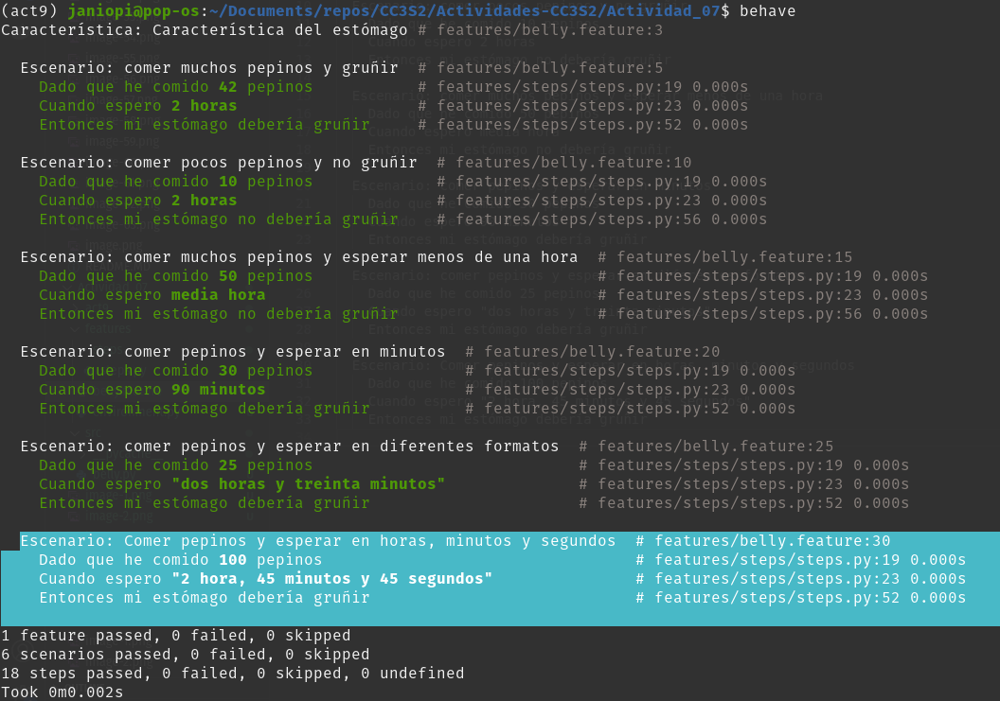
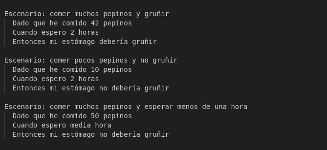
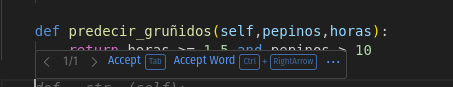

### Actividad: Pruebas BDD con behave en español

Este proyecto es un ejemplo de cómo utilizar **behave**, una herramienta para pruebas de desarrollo dirigido por comportamiento (Behavior-Driven Development - BDD) en Python, para escribir y ejecutar pruebas en español. Simula el comportamiento de un estómago (`Belly`) que gruñe o no en función de la cantidad de pepinos consumidos y el tiempo de espera.

### Objetivos de aprendizaje

Esta actividad tiene como propósito:

- Implementar los pasos de los escenarios BDD en Python, conectando las especificaciones de negocio con el código.
- Desarrollar pruebas unitarias con **Pytest**, aplicando principios de **TDD**.
- Estructurar correctamente un proyecto con **carpetas separadas para código fuente, pruebas unitarias y pruebas BDD**.
- Diseñar funciones capaces de interpretar y validar entradas humanas como descripciones de tiempo (ej. "dos horas y media").
- Manejar correctamente **errores y validaciones de entrada**, incluyendo casos fraccionarios o no válidos.
- Experimentar un ciclo completo de desarrollo: **historia de usuario → criterios de aceptación → pruebas → código → validación**.

### Tabla de contenidos

- [Requisitos previos](#requisitos-previos)
- [Estructura del proyecto](#estructura-del-proyecto)
- [Instalación](#instalación)
- [Ejecutar las pruebas](#ejecutar-las-pruebas)
- [Detalles del proyecto](#detalles-del-proyecto)
- [Referencias](#referencias)

### Requisitos previos

- **Python 3.6** o superior
- **pip** (gestor de paquetes de Python)

### Estructura del proyecto

El proyecto tiene la siguiente estructura de directorios:

```
.
├── features
│   ├── belly.feature
│   ├── environment.py
│   └── steps
│       └── steps.py
├── src
│   └── belly.py
└── README.md
```

- **features**: Contiene los archivos relacionados con Behave.
  - **belly.feature**: Archivo que describe las características y escenarios en lenguaje Gherkin.
  - **environment.py**: Archivo de configuración para inicializar el contexto de Behave.
  - **steps**: Carpeta que contiene las definiciones de los pasos.
    - **steps.py**: Implementación de los pasos definidos en `belly.feature`.
- **src**: Contiene el código fuente del proyecto.
  - **belly.py**: Implementación de la clase `Belly`.
- **README.md**: Este archivo de documentación.

#### Instalación

Sigue estos pasos para configurar el entorno y ejecutar el proyecto:

1. **Clona el repositorio o descarga el código fuente**:

   ```bash
   git clone https://github.com/tu_usuario/tu_proyecto.git
   cd tu_proyecto
   ```

   (En nuestro caso nos limitamos a descargar los archivos)

2. **Crea y activa un entorno virtual llamado act9**:

   ```bash
   python3 -m venv act9
   source act9/bin/activate  # En Windows usa: act9\Scripts\activate

   ```

   

3. **Instala las dependencias necesarias**:

   Si tienes un archivo `requirements.txt`, instala las dependencias con:

   ```bash
   pip install -r requirements.txt
   ```

   (No tenemos dependencias)

   Si no tienes un `requirements.txt`, instala Behave directamente:

   ```bash
   pip install behave
   ```

   

### Ejecutar las pruebas

Para ejecutar las pruebas, utiliza el comando:

```bash
behave
```


Este comando buscará automáticamente los archivos `.feature` dentro de la carpeta `features` y ejecutará los escenarios definidos.

### Detalles del proyecto

#### Archivo `features/belly.feature`

Este archivo define las características y escenarios a probar utilizando el lenguaje Gherkin en español. Es importante especificar el idioma al inicio del archivo.

```gherkin
# language: es

Característica: Comportamiento del Estómago

  Escenario: Comer muchos pepinos y gruñir
    Dado que he comido 42 pepinos
    Cuando espero 2 horas
    Entonces mi estómago debería gruñir

  Escenario: Comer pocos pepinos y no gruñir
    Dado que he comido 10 pepinos
    Cuando espero 2 horas
    Entonces mi estómago no debería gruñir

  Escenario: Comer muchos pepinos y esperar menos de una hora
    Dado que he comido 50 pepinos
    Cuando espero media hora
    Entonces mi estómago no debería gruñir

  Escenario: Comer pepinos y esperar en minutos
    Dado que he comido 30 pepinos
    Cuando espero 90 minutos
    Entonces mi estómago debería gruñir

  Escenario: Comer pepinos y esperar en diferentes formatos
    Dado que he comido 25 pepinos
    Cuando espero "dos horas y treinta minutos"
    Entonces mi estómago debería gruñir
```

#### Archivo `features/steps/steps.py`

Contiene las definiciones de los pasos correspondientes a los escenarios en `belly.feature`. Se encarga de implementar la lógica detrás de cada paso.

```python
from behave import given, when, then
import re

# Función para convertir palabras numéricas a números
def convertir_palabra_a_numero(palabra):
    try:
        return int(palabra)
    except ValueError:
        numeros = {
            "cero": 0, "uno": 1, "una": 1, "dos": 2, "tres": 3, "cuatro": 4, "cinco": 5,
            "seis": 6, "siete": 7, "ocho": 8, "nueve": 9, "diez": 10, "once": 11,
            "doce": 12, "trece": 13, "catorce": 14, "quince": 15, "dieciséis": 16,
            "diecisiete": 17, "dieciocho": 18, "diecinueve": 19, "veinte": 20,
            "treinta": 30, "cuarenta": 40, "cincuenta": 50, "sesenta": 60, "setenta": 70,
            "ochenta": 80, "noventa": 90, "media": 0.5
        }
        return numeros.get(palabra.lower(), 0)

@given('que he comido {cukes:d} pepinos')
def step_given_eaten_cukes(context, cukes):
    context.belly.comer(cukes)

@when('espero {time_description}')
def step_when_wait_time_description(context, time_description):
    time_description = time_description.strip('"').lower()
    time_description = time_description.replace('y', ' ')
    time_description = time_description.strip()

    if time_description == 'media hora':
        total_time_in_hours = 0.5
    else:
        pattern = re.compile(r'(?:(\w+)\s*horas?)?\s*(?:(\w+)\s*minutos?)?')
        match = pattern.match(time_description)

        if match:
            hours_word = match.group(1) or "0"
            minutes_word = match.group(2) or "0"

            hours = convertir_palabra_a_numero(hours_word)
            minutes = convertir_palabra_a_numero(minutes_word)

            total_time_in_hours = hours + (minutes / 60)
        else:
            raise ValueError(f"No se pudo interpretar la descripción del tiempo: {time_description}")

    context.belly.esperar(total_time_in_hours)

@then('mi estómago debería gruñir')
def step_then_belly_should_growl(context):
    assert context.belly.esta_gruñendo(), "Se esperaba que el estómago gruñera, pero no lo hizo."

@then('mi estómago no debería gruñir')
def step_then_belly_should_not_growl(context):
    assert not context.belly.esta_gruñendo(), "Se esperaba que el estómago no gruñera, pero lo hizo."
```

#### Archivo `features/environment.py`

Inicializa el contexto antes de cada escenario, creando una nueva instancia de `Belly`.

```python
from src.belly import Belly

def before_scenario(context, scenario):
    context.belly = Belly()
```

#### Archivo `src/belly.py`

Implementa la lógica de la clase `Belly`, que simula el comportamiento del estómago.

```python
class Belly:
    def __init__(self):
        self.pepinos_comidos = 0
        self.tiempo_esperado = 0

    def comer(self, pepinos):
        self.pepinos_comidos += pepinos

    def esperar(self, tiempo_en_horas):
        self.tiempo_esperado += tiempo_en_horas

    def esta_gruñendo(self):
        # El estómago gruñe si ha esperado al menos 1.5 horas y ha comido más de 10 pepinos
        return self.tiempo_esperado >= 1.5 and self.pepinos_comidos > 10
```

---

#### Ejercicio 1: **Añadir soporte para minutos y segundos en tiempos de espera**

**Objetivo**

- Ampliar la funcionalidad para reconocer tiempos de espera expresados en horas, minutos y segundos.

**Instrucciones**

1. **Modifica** la función que maneja el tiempo de espera en `steps.py` (o donde parsees el tiempo) para que acepte:

   - "1 hora y 30 minutos"
   - "90 minutos"
   - "3600 segundos"
   - **Variaciones** que incluyan segundos (por ejemplo, `"1 hora, 30 minutos y 45 segundos"`).

   

2. **Implementa** un escenario de prueba en Gherkin (`belly.feature`) que valide que el estómago gruñe o no según estas variaciones de tiempo.




3. **Considera** también crear pruebas unitarias con Pytest para la lógica de parsing (función que convierte el texto de tiempo sen horas decimales).

4. **En un entorno DevOps**:

- Agrega la ejecución de `behave` y `pytest` en tu _pipeline_ de CI/CD, de modo que al hacer push de los cambios se ejecuten automáticamente las pruebas.

#### Ejercicio 2: **Manejo de cantidades fraccionarias de pepinos**

**Objetivo**

- Permitir que el sistema acepte cantidades fraccionarias de pepinos (decimales).

**Instrucciones**

1. **Modifica** el sistema (la clase `Belly` y los steps en Behave) para que acepte entradas como `"0.5"`, `"2.75"`.


2. **Implementa** un nuevo escenario en Gherkin donde se ingiera una cantidad fraccionaria y verifica el comportamiento.


3. **Valida** que el sistema lance una excepción o error si se ingresa una cantidad negativa de pepinos.


4. **Pruebas unitarias**:

   - Cubre el caso de pepinos fraccionarios en `test_belly.py`.
   - Cubre también el caso de pepinos negativos (se espera un error).

   

   

#### Ejercicio 3: **Soporte para idiomas múltiples (Español e Inglés)**

**Objetivo**

- Aceptar descripciones de tiempo en distintos idiomas (español e inglés).

**Instrucciones**

1. **Modifica** el parsing de tiempo para que reconozca palabras clave en inglés, además de español (por ejemplo, `"two hours"`, `"thirty minutes"`).

   

2. **Escribe** al menos dos escenarios de prueba en Gherkin que usen tiempos en inglés.


#### Ejercicio 4: **Manejo de tiempos aleatorios**

**Objetivo**

- Permitir ingresar rangos de tiempo (por ejemplo, "entre 1 y 3 horas") y escoger un tiempo aleatorio dentro de ese rango.

**Instrucciones**

1. **Crea** una función que, dada una expresión como "entre 1 y 3 horas", devuelva un valor aleatorio entre 1 y 3 horas.
   

   

2. **Implementa** un escenario en Gherkin que verifique que, tras comer pepinos y esperar un tiempo aleatorio, el estómago puede gruñir.

 3. **Imprime** (en consola o logs) el tiempo aleatorio elegido para que el resultado sea rastreable en tu pipeline.


#### Ejercicio 5: **Validación de cantidades no válidas**

**Objetivo**

- Manejar y reportar adecuadamente errores al ingresar cantidades no válidas.

**Instrucciones**

1. **Añade** validaciones para evitar que el usuario ingrese < 0 pepinos o > 100 pepinos.
   Modificando el método comer de la clase Belly
   

2. **Modifica** la lógica para arrojar un error (excepción) si la cantidad no es válida.
   Si la cantidad no es válida lanza el siguiente mensaje: "Cantidad de pepinos no válida. El rango debe estar entre 0 y 100"
   

3. **Implementa** un escenario de prueba que verifique el comportamiento de error.

   

#### Ejercicio 6: **Escalabilidad con grandes cantidades de pepinos**

**Objetivo**

- Asegurar que el sistema no falle ni se ponga lento con cantidades y tiempos muy grandes.

**Instrucciones**

1. **Añade** soporte para manejar cantidades de pepinos como 1000 (más allá del límite de validación anterior, o ajusta ese límite para pruebas internas).


Modificando el método comer de la clase Belly

2. **Implementa** un escenario en Gherkin para comer 1000 pepinos y esperar 10 horas.
   

3. **Verifica** que el sistema sigue comportándose correctamente (sin timeouts ni errores de rendimiento).


#### Ejercicio 7: **Descripciones de tiempo complejas**

**Objetivo**

- Ampliar la lógica para manejar descripciones avanzadas tipo `"1 hora, 30 minutos y 45 segundos"`.

**Instrucciones**

1. **Refuerza** la expresión regular y parsing para que soporte múltiples separadores (comas, "y", espacios, etc.).
   En steps.py, modificamos
   

2. **Implementa** escenarios que cubran al menos 2-3 variaciones complejas en Gherkin.
   

3. **Valida** que el total en horas sea exacto (suma de horas, minutos, segundos).
   

#### Ejercicio 8: **De TDD a BDD – Convertir requisitos técnicos a pruebas en Gherkin**

**Objetivo**

- Practicar el paso de una prueba unitaria técnica a un escenario BDD comprensible por el negocio.

**Instrucciones**

1. **Escribe** un test unitario básico con Pytest que valide que si se han comido más de 10 pepinos y se espera 2 horas, el estómago gruñe.
   Agregando el test a test_belly.py
   

2. **Convierte** ese test unitario en un escenario Gherkin, con la misma lógica, pero más orientado al usuario.
   Agregando a belly.feature
   
3. **Implementa** los pasos en Behave (si no existen).
   Ya esta implementado en steps.py
   

4. **Ejecutando**:

   - Ejecuta primero los tests unitarios (rápidos) y luego los tests de Behave (que pueden ser más lentos y de nivel de integración).

   Pasa el test
   

   Ejecutando behave
   

#### Ejercicio 9: **Identificación de criterios de aceptación para historias de usuario**

**Objetivo**

- Traducir una historia de usuario en criterios de aceptación claros y escenarios BDD.

**Instrucciones**

1. **Toma** la historia de usuario:

   > "Como usuario que ha comido pepinos, quiero saber si mi estómago va a gruñir después de esperar un tiempo suficiente, para poder tomar una acción."

2. **Identifica** los criterios de aceptación (por ejemplo, cuántos pepinos y cuánto tiempo se debe esperar).

Los criterios se encuentran definidos en belly.py


Si el número de pepinos ingeridos es más de 10 y el tiempo esperado es más de 1 hora, el estómago debería gruñir.

3. **Escribe** escenarios Gherkin que reflejen esos criterios.

Utilizaremos escenarios anteriores para esta prueba


4. **Implementa** los pasos en Behave.


#### Ejercicio 10: **Escribir pruebas unitarias antes de escenarios BDD**

**Objetivo**

- Demostrar la secuencia TDD (tests unitarios) → BDD (escenarios).

**Instrucciones**

1. **Escribe** un test unitario para una nueva función, por ejemplo, `pepinos_comidos()`, que retorna el total de pepinos ingeridos.

Modificando test_belly.py


2. **Crea** un escenario Gherkin que describe este comportamiento desde el punto de vista del usuario.


3. **Implementa** los pasos en Behave y verifica que pase la misma validación.


4. **Ejecutando**:

- Ejecución secuencial: 1) Pytest, 2) Behave.


#### Ejercicio 11: **Refactorización guiada por TDD y BDD**

**Objetivo**

- Refactorizar código existente sin romper funcionalidades, validado por pruebas unitarias y escenarios BDD.

**Instrucciones**

1. **Elige** una funcionalidad ya existente (por ejemplo, `esta_gruñendo()`).
   Elegimos esta_gruñendo()
   
2. **Escribe** (o asegura que existen) pruebas unitarias que cubran los casos clave.
   

3. **Refactoriza** el código (`Belly` o funciones auxiliares) para mejorar eficiencia, legibilidad o reducir duplicación.

4. **Valida** que todas las pruebas unitarias y escenarios BDD siguen pasando sin cambios.


(El error se debe a que en un escenario estamos utilizando una cantidad de pepinos negativos. Esto se pedía en uno de los incisos anteriores)

#### Ejercicio 12: **Ciclo completo de TDD a BDD – Añadir nueva funcionalidad**

**Objetivo**

- Desarrollar una nueva funcionalidad _desde cero_ con TDD (prueba unitaria) y BDD (escenarios Gherkin).

**Instrucciones**

1. **Imagina** una nueva funcionalidad, por ejemplo, "Predecir si el estómago gruñirá con una cantidad dada de pepinos y un tiempo de espera".



2. **Escribe** primero la prueba unitaria.


3. **Conviértelo** en una historia de usuario y escribe el escenario BDD.
   

4. **Implementa** y verifica que tanto la prueba unitaria como el escenario Gherkin pasen.
   

   

   

#### Ejercicio 13: **Añadir criterios de aceptación claros**

**Objetivo**

- Definir con precisión los criterios de aceptación de una nueva funcionalidad y plasmarlos en Gherkin.

**Instrucciones**

1. **Define** una nueva historia de usuario (por ejemplo, "Ver cuántos pepinos me faltan para gruñir").

2. **Identifica** al menos 2-3 criterios de aceptación.

- Si aún no se ha llegado al umbral (>10 pepinos y >=1.5 horas), debe indicar cuántos pepinos faltan.
- Si el tiempo es suficiente pero los pepinos son pocos, solo debe sugerir los pepinos faltantes.
- Si los pepinos son suficientes pero falta tiempo, puede devolver "esperar más" .

3. **Convierte** esos criterios en escenarios BDD.

 4. **Implementa** los pasos.


#### Ejercicio 14: **Integración con Mocking, Stubs y Fakes (para DevOps)**

**Objetivo**

- Demostrar cómo inyectar dependencias simuladas en tu clase `Belly` y usarlas en pruebas BDD y TDD.

**Instrucciones**

1. **Crea** un archivo `clock.py` (por ejemplo) con una función `get_current_time()`.
   

2. **Modifica** `Belly` para aceptar un `clock_service` opcional que se inyecta.
   En el constructor
   

3. **Crea** un test unitario con Pytest que use `unittest.mock` para simular el paso del tiempo.
   

4. **En Behave**, usa `environment.py` para inyectar un mock o stub del reloj en el `before_scenario`.
   

   

#### Ejercicio 15: **Despliegue y validación continua en un entorno de integración (CI/CD)**

**Objetivo**

- Completar el ciclo DevOps: Cada push al repositorio **desencadena** pruebas automáticas BDD y TDD.

**Instrucciones**

1. **Configura** un pipeline (por ejemplo, en GitHub Actions o GitLab CI) con estos pasos:
   - Instalar dependencias (Python, Behave, Pytest).
   - Ejecutar pruebas unitarias (Pytest).
   - Ejecutar pruebas de comportamiento (Behave).
   - Generar reportes (HTML, JUnit) y publicarlos como _artifacts_.
2. **Incluye** verificación de calidad de código (por ejemplo, flake8 o black).
3. **Al aprobarse** el pipeline, **despliega** (si corresponde) tu aplicación o _script_ a un entorno de staging/producción.

---

#### Referencias

- [Documentación de Behave](https://behave.readthedocs.io/en/latest/)
- [Referencia de Gherkin](https://cucumber.io/docs/gherkin/reference/)
- [Desarrollo Dirigido por Comportamiento (BDD) en Wikipedia](https://es.wikipedia.org/wiki/Desarrollo_guiado_por_pruebas#Desarrollo_guiado_por_el_comportamiento)

#### Notas adicionales

- **Idioma**: Asegúrate de que todos los archivos `.feature` comienzan con `# language: es` para indicar que los pasos están en español.
- **Codificación**: Guarda todos los archivos en formato UTF-8 para evitar problemas con caracteres especiales.
- **Versión de Behave**: Se recomienda utilizar la última versión de Behave para garantizar el soporte completo del idioma español.
