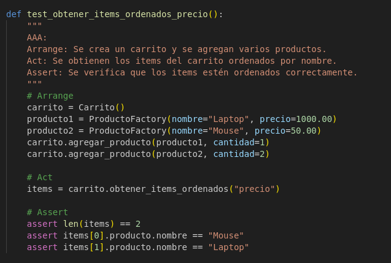

### Actividad: El patrón Arrange-Act-Assert

Las pruebas unitarias no son nada misteriosas. Son solo código ejecutable escrito en el mismo lenguaje que la aplicación. Cada prueba de unidad constituye el primer uso del código que se desea escribir. Se llama al código tal como se llamará en la aplicación real.

La prueba ejecuta ese código, captura los resultados que nos interesan y verifica que sean lo que esperábamos. Dado que la prueba usa el código de la misma manera que la aplicación, recibimos comentarios inmediatos sobre qué tan fácil o difícil es usarlo. Esto puede sonar obvio, y lo es, pero es una herramienta poderosa para escribir código limpio y correcto.

#### Objetivos de aprendizaje

- Aplicar el patrón **Arrange-Act-Assert (AAA)** para estructurar pruebas unitarias claras y legibles.
- Escribir pruebas efectivas usando **Pytest**, utilizando buenas prácticas como una sola aserción por prueba.
- Comprender y aplicar los principios **FIRST** para mejorar la calidad de las pruebas.

#### Definición de la estructura de la prueba

Es útil seguir plantillas al hacer pruebas unitarias, y no son una excepción. Kent Beck, el inventor de TDD, descubrió que las pruebas unitarias tenían características en común. Esto se resumió en la estructura llamada **Arrange-Act-Assert (AAA)**.

#### La definición original de AAA

La descripción original de AAA se puede encontrar en el wiki de C2: [Arrange-Act-Assert](http://wiki.c2.com/?ArrangeActAssert).

A continuación, se presenta un ejemplo de una prueba unitaria para asegurarse de que un nombre de usuario se muestre en minúsculas:

#### Definición de una buena prueba

Como todo código, el código de prueba unitaria se puede escribir de mejores o peores maneras. Ya hemos visto cómo **Arrange-Act-Assert (AAA)** nos ayuda a estructurar correctamente una prueba y cómo los nombres descriptivos y precisos cuentan la historia de lo que nuestro código debe hacer. Las pruebas más útiles también siguen los principios **FIRST** y usan una sola aserción por prueba.

##### Aplicando los principios FIRST

Los principios **FIRST** son un conjunto de cinco reglas que hacen que las pruebas unitarias sean más efectivas:

1. **Rápido**: Las pruebas unitarias deben ejecutarse rápidamente, tal como vimos en el ejemplo anterior. Esto es crucial para **TDD** ya que queremos recibir retroalimentación inmediata mientras exploramos nuestro diseño e implementación. Si una prueba tarda demasiado en ejecutarse, es probable que dejemos de ejecutarlas con frecuencia, lo que puede llevarnos a escribir grandes fragmentos de código sin pruebas. Esto va en contra del espíritu de TDD, por lo que debemos trabajar para que nuestras pruebas sean rápidas. Idealmente, las pruebas deben ejecutarse en milisegundos o menos de 2 segundos.

2. **Aislado**: Las pruebas unitarias deben estar completamente aisladas unas de otras. Esto significa que podemos ejecutar cualquier prueba, o cualquier combinación de ellas, en el orden que queramos, obteniendo siempre el mismo resultado. Si una prueba depende del resultado de otra, se generará un falso negativo, lo que hará que la prueba sea inútil. El aislamiento es clave para un flujo de trabajo saludable en **TDD**.

3. **Repetible**: Las pruebas deben ser repetibles. Esto significa que cada vez que ejecutamos una prueba con el mismo código de producción, esa prueba debe devolver siempre el mismo resultado, ya sea éxito o falla. Si las pruebas dependen de factores externos como el tiempo, la red o el estado de una base de datos, puede ser difícil mantener esta repetibilidad. Para abordar estos casos, se suelen utilizar **Stubs** y **Mocks**, que simulan el comportamiento de dependencias externas.

4. **Autoverificable**: Las pruebas deben ser autoverificables. Esto significa que deben incluir toda la lógica necesaria para determinar si el código bajo prueba funciona correctamente. No debemos requerir intervención manual, como revisar una consola o un archivo de registro. La automatización es clave aquí: las pruebas deben ejecutarse y darnos una respuesta inmediata de "aprobado" o "fallado".

5. **Oportuno**: Las pruebas deben escribirse en el momento justo, es decir, antes de escribir el código que hace que la prueba pase. Este es el núcleo del desarrollo impulsado por pruebas (**TDD**). Las pruebas oportunas nos permiten recibir comentarios sobre el diseño del código y evitar errores tempranos.

##### Escribiendo una sola aserción por prueba

Una buena práctica en las pruebas unitarias es escribir una sola aserción por prueba. Esto tiene varias ventajas. En primer lugar, si la prueba falla, sabremos inmediatamente cuál fue el problema, ya que la prueba está probando un único comportamiento. Además, las pruebas con una sola aserción tienden a ser más fáciles de entender y mantener.

Volviendo al ejemplo en Python, la prueba `test_converts_to_lowercase()` contiene una única aserción con `self.assertEqual(actual, "sirjakington35179")`. Si esta aserción falla, sabemos que el método `as_lowercase()` no está funcionando como se esperaba, sin necesidad de inspeccionar múltiples aserciones.

##### Mejorando la retroalimentación en TDD

Al seguir los principios FIRST y la estructura AAA, podemos asegurarnos de que nuestras pruebas unitarias sean útiles, rápidas y confiables. Estas pruebas no solo validan nuestro código, sino que también nos proporcionan una valiosa retroalimentación durante el proceso de diseño y desarrollo. Ver cómo las pruebas fallidas (pruebas rojas) se convierten en pruebas exitosas (pruebas verdes) genera confianza en nuestro código.

Las pruebas unitarias también promueven el código de alta calidad, ya que nos obligan a pensar en cómo se usará el código desde el principio. Este enfoque basado en pruebas es clave para mantener la calidad y robustez de los sistemas de software.

Este patrón ayuda a mantener las pruebas organizadas y fáciles de leer.

#### Ejercicios

##### Ejercicio 1: Método para vaciar el carrito

**Objetivo:**  
Implementa en la clase `Carrito` un método llamado `vaciar()` que elimine todos los items del carrito. Luego, escribe pruebas siguiendo el patrón AAA para verificar que, al vaciar el carrito, la lista de items quede vacía y el total sea 0.

**Pistas:**

- Agrega el método `vaciar` en `src/carrito.py` que realice `self.items = []`.
  
- Crea pruebas en `tests/test_carrito.py` que agreguen varios productos, invoquen `vaciar()` y verifiquen que `obtener_items()` retorne una lista vacía y `calcular_total()` retorne 0.
  

  

##### Ejercicio 2: Descuento por compra mínima

**Objetivo:**  
Amplía la lógica del carrito para aplicar un descuento solo si el total supera un monto determinado. Por ejemplo, si el total es mayor a \$500, se aplica un 15% de descuento.

**Pistas:**

- Agrega un nuevo método, por ejemplo, `aplicar_descuento_condicional(porcentaje, minimo)` en la clase `Carrito` que primero verifique si `calcular_total() >= minimo`.
- Si se cumple la condición, aplica el descuento; de lo contrario, retorna el total sin descuento.
  

- Escribe pruebas para ambos escenarios (condición cumplida y no cumplida).

  Condición cumplida

  - 

  No Cumplida

  - 

  

##### Ejercicio 3: Manejo de stock en producto

**Objetivo:**  
Modifica la clase `Producto` para que incluya un atributo `stock` (cantidad disponible). Luego, actualiza el método `agregar_producto` en `Carrito` para que verifique que no se agregue una cantidad mayor a la disponible en stock. Si se intenta agregar más, se debe lanzar una excepción.

**Pistas:**

- Modifica `Producto` en `src/carrito.py` añadiendo `self.stock = stock` en el constructor y actualiza la fábrica en `src/factories.py` para que genere un stock (por ejemplo, entre 1 y 100).

  - 
  - 

- En `Carrito.agregar_producto`, antes de agregar o incrementar la cantidad, verifica que la suma de cantidades en el carrito no supere el `stock` del producto.

  - 

- Escribe pruebas que verifiquen:

  - Se puede agregar un producto dentro del límite de stock.
    - 
  - Se lanza una excepción al intentar agregar más unidades de las disponibles.
    - 


##### Ejercicio 4: Ordenar items del carrito

**Objetivo:**  
Agrega un método en `Carrito` que devuelva la lista de items ordenados por un criterio (por ejemplo, por precio unitario o por nombre del producto).

**Pistas:**

- Crea un método `obtener_items_ordenados(criterio: str)` donde `criterio` pueda ser `"precio"` o `"nombre"`.
- Utiliza la función `sorted()` con una función lambda para ordenar según el criterio.

  - 

- Escribe pruebas que verifiquen que, al agregar varios productos, la lista devuelta esté ordenada correctamente según el criterio solicitado.

  - Test ordenamiento por precio
  - 
  - Test ordenamiento por nombre
  - 
  - Test ordenamiento por stock
  - 

  

##### Ejercicio 5: Uso de Pytest Fixtures

**Objetivo:**  
Refactoriza las pruebas para que utilicen **fixtures** de Pytest, de modo que se reutilicen instancias comunes de `Carrito` o de productos.

**Pistas:**

- En el archivo `tests/conftest.py`, crea una fixture para un carrito vacío:

  ```python
  import pytest
  from src.carrito import Carrito

  @pytest.fixture
  def carrito():
      return Carrito()
  ```

  - 

- Crea también una fixture para un producto genérico, usando la fábrica:

  ```python
  import pytest
  from src.factories import ProductoFactory

  @pytest.fixture
  def producto_generico():
      return ProductoFactory(nombre="Genérico", precio=100.0)
  ```

  - 

- Actualiza las pruebas existentes para usar estas fixtures en lugar de instanciar los objetos directamente en cada test.

  - 

##### Ejercicio 6: Pruebas parametrizadas

**Objetivo:**  
Utiliza la marca `@pytest.mark.parametrize` para crear pruebas que verifiquen múltiples escenarios de descuento o actualización de cantidades.

**Pistas:**

- Por ejemplo, parametriza pruebas para `aplicar_descuento` usando distintos porcentajes y totales esperados.

  - 

- De igual forma, para actualizar cantidades: prueba con diferentes valores (válidos e inválidos) y verifica que se lance la excepción en los casos correspondientes.
  - 

##### Ejercicio 7: Calcular impuestos en el carrito

**Objetivo:**  
Implementar un método `calcular_impuestos(porcentaje)` que retorne el valor del impuesto calculado sobre el total del carrito.

##### Red

1. **Escribir la prueba que falla:**  
   Crea un nuevo archivo de pruebas (por ejemplo, `tests/test_impuestos.py`) y escribe una prueba que espere que, dado un carrito con un total de \$1000, al aplicar un 10% de impuestos se retorne \$100.

   

   _En este punto, la prueba fallará porque el método `calcular_impuestos` aún no existe._

##### Green

2. **Implementar el código mínimo:**  
   En `src/carrito.py`, añade el método de forma mínima para que la prueba pase:

   

##### Refactor

3. **Refactorizar:**

   - Agrega validaciones para que el porcentaje esté en un rango razonable (por ejemplo, entre 0 y 100).
   - Añade documentación al método.

     - 

##### Ejercicio 8: Aplicar cupón de descuento con límite máximo

**Objetivo:**  
Implementar un método `aplicar_cupon(descuento_porcentaje, descuento_maximo)` que aplique un cupón de descuento al total del carrito, pero asegurándose de que el descuento no supere un valor máximo.

##### Red

1. **Escribir la prueba que falla:**  
   Crea un archivo, por ejemplo, `tests/test_cupon.py` y escribe una prueba que verifique que, para un carrito con total \$400 y un cupón del 20% (lo que daría \$80), si el descuento máximo es \$50, el método retorne \$350.

   

##### Green

2. **Implementar el código mínimo:**  
   En `src/carrito.py`, añade un método para aplicar el cupón de descuento de forma básica:

   ```python
    
   ```

##### Refactor

3. **Refactorizar:**

   - Agrega validaciones para que el porcentaje de descuento y el máximo sean valores positivos.
   - Separa la lógica de cálculo y validación, y documenta el método.

   - 

##### Ejercicio 9: Validación de stock al agregar productos (RGR)

**Objetivo:**  
Asegurarse de que al agregar un producto al carrito, no se exceda la cantidad disponible en stock.

##### Red

1. **Escribir la prueba que falla:**  
   En un nuevo archivo, por ejemplo, `tests/test_stock.py`, escribe una prueba que verifique que si se intenta agregar más unidades de las disponibles, se lance una excepción.
   - 

##### Green

2. **Implementar el código mínimo:**  
   Modifica el método `agregar_producto` en `Carrito` para que valide el stock:

   ```python
   def agregar_producto(self, producto, cantidad=1):
       # Verifica el stock disponible
       total_en_carrito = 0
       for item in self.items:
           if item.producto.nombre == producto.nombre:
               total_en_carrito = item.cantidad
               break
       if total_en_carrito + cantidad > producto.stock:
           raise ValueError("Cantidad a agregar excede el stock disponible")

       # Si el producto ya existe, incrementa la cantidad
       for item in self.items:
           if item.producto.nombre == producto.nombre:
               item.cantidad += cantidad
               return
       self.items.append(ItemCarrito(producto, cantidad))
   ```

##### Refactor

3. **Refactorizar:**

   - Centraliza la validación del stock en un método privado o en la clase `Producto` si es necesario.
   - Documenta la función y separa la lógica de búsqueda del producto en el carrito.

   ```python
   def _buscar_item(self, producto):
       for item in self.items:
           if item.producto.nombre == producto.nombre:
               return item
       return None

   def agregar_producto(self, producto, cantidad=1):
       """
       Agrega un producto al carrito verificando que la cantidad no exceda el stock disponible.

       Args:
           producto (Producto): Producto a agregar.
           cantidad (int): Cantidad a agregar.

       Raises:
           ValueError: Si la cantidad total excede el stock del producto.
       """
       item = self._buscar_item(producto)
       cantidad_actual = item.cantidad if item else 0

       if cantidad_actual + cantidad > producto.stock:
           raise ValueError("Cantidad a agregar excede el stock disponible")

       if item:
           item.cantidad += cantidad
       else:
           self.items.append(ItemCarrito(producto, cantidad))
   ```

   - 

Ejecutando los test

