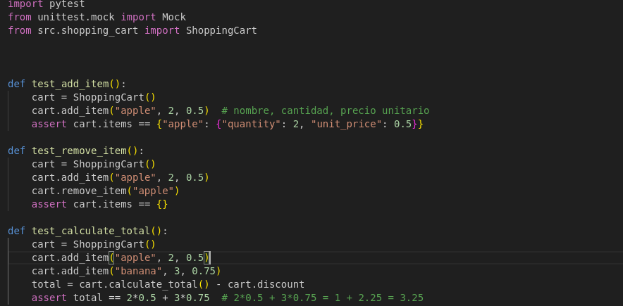
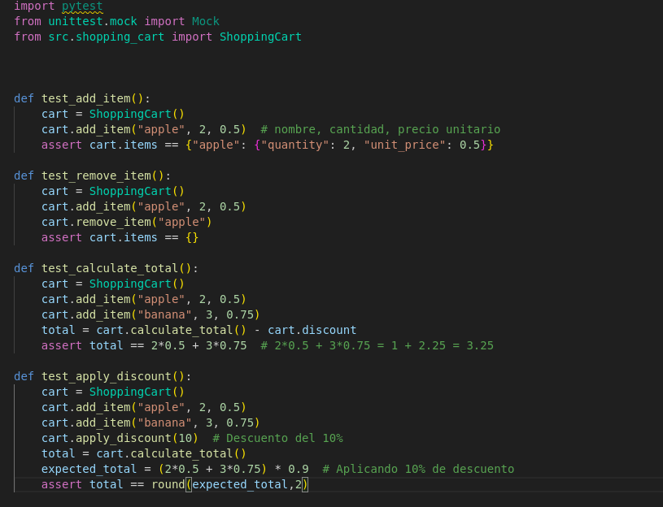

### Actividad: Red-Green-Refactor

**Objetivo de aprendizaje:** El objetivo de este proyecto es desarrollar una clase ShoppingCart que permita gestionar de forma eficiente un carrito de compras. La clase debe soportar las siguientes funcionalidades:

- Agregar artículos al carrito: Permitir añadir productos especificando nombre, cantidad y precio unitario, gestionando la posibilidad de agregar múltiples cantidades del mismo producto.
- Eliminar artículos del carrito: Remover productos previamente agregados.
- Calcular el total del carrito: Sumar el costo total de los artículos en el carrito, considerando la cantidad y precio unitario de cada uno.
- Aplicar descuentos: Permitir la aplicación de un descuento porcentual sobre el total del carrito, con validación de rango y redondeo a dos decimales.
- Procesar pagos a través de un servicio externo: Integrar un gateway de pago mediante inyección de dependencias para facilitar pruebas utilizando mocks y stubs, permitiendo simular el procesamiento de pagos sin realizar llamadas a servicios externos reales.

El proyecto se desarrollará de forma incremental utilizando el proceso RGR (Red, Green, Refactor) y pruebas unitarias con pytest para asegurar la correcta implementación de cada funcionalidad.

#### Introducción a Red-Green-Refactor

**Red-Green-Refactor** es un ciclo de TDD que consta de tres etapas:

1. **Red (Fallo):** Escribir una prueba que falle porque la funcionalidad aún no está implementada.
2. **Green (Verde):** Implementar la funcionalidad mínima necesaria para que la prueba pase.
3. **Refactor (Refactorizar):** Mejorar el código existente sin cambiar su comportamiento, manteniendo todas las pruebas pasando.

Este ciclo se repite iterativamente para desarrollar funcionalidades de manera segura y eficiente.

### Ejemplo

La funcionalidad que mejoraremos será una clase `ShoppingCart` que permite agregar artículos, eliminar artículos y calcular el total del carrito. El código será acumulativo, es decir, cada iteración se basará en la anterior. Utiliza la siguiente estructura para este ejemplo:

```
├── pytest.ini
├── src
│   └── shopping_cart.py
└── tests
    └── test_shopping_cart.py

```

#### **Primera iteración (RGR 1): Agregar artículos al carrito**

**1. Escribir una prueba que falle (Red)**

Primero, escribimos una prueba para agregar un artículo al carrito. Dado que aún no hemos implementado la funcionalidad, esta prueba debería fallar.

```python
# test_shopping_cart.py
import pytest
from shopping_cart import ShoppingCart

def test_add_item():
    cart = ShoppingCart()
    cart.add_item("apple", 2, 0.5)  # nombre, cantidad, precio unitario
    assert cart.items == {"apple": {"quantity": 2, "unit_price": 0.5}}
```

**2. Implementar el código para pasar la prueba (Green)**

Implementamos la clase `ShoppingCart` con el método `add_item` para pasar la prueba.

```python
# shopping_cart.py
class ShoppingCart:
    def __init__(self):
        self.items = {}

    def add_item(self, name, quantity, unit_price):
        self.items[name] = {"quantity": quantity, "unit_price": unit_price}
```

**3. Refactorizar el código si es necesario (Refactor)**

En este caso, el código es sencillo y no requiere refactorización inmediata. Sin embargo, podríamos anticipar mejoras futuras, como manejar múltiples adiciones del mismo artículo.

#### **Segunda iteración (RGR 2): Eliminar artículos del carrito**

**1. Escribir una prueba que falle (Red)**

Añadimos una prueba para eliminar un artículo del carrito.


**2. Implementar el código para pasar la prueba (Green)**

Añadimos el método `remove_item` a la clase `ShoppingCart`.


**3. Refactorizar el código si es necesario (Refactor)**

Podemos mejorar el método `add_item` para manejar la adición de múltiples cantidades del mismo artículo.


#### **Tercera iteración (RGR 3): Calcular el total del carrito**

**1. Escribir una prueba que falle (Red)**

Añadimos una prueba para calcular el total del carrito.


**2. Implementar el código para pasar la prueba (Green)**

Implementamos el método `calculate_total`.


**3. Refactorizar el código si es necesario (Refactor)**

Podemos optimizar el método `calculate_total` utilizando comprensión de listas y la función `sum`.

```python
# shopping_cart.py
class ShoppingCart:
    def __init__(self):
        self.items = {}

    def add_item(self, name, quantity, unit_price):
        if name in self.items:
            self.items[name]["quantity"] += quantity
        else:
            self.items[name] = {"quantity": quantity, "unit_price": unit_price}

    def remove_item(self, name):
        if name in self.items:
            del self.items[name]

    def calculate_total(self):
        return sum(item["quantity"] * item["unit_price"] for item in self.items.values())
```

#### **Código final acumulativo**

**shopping_cart.py**


**test_shopping_cart.py**



#### **Ejecutar las pruebas**

Para ejecutar las pruebas, asegúrate de tener `pytest` instalado y ejecuta el siguiente comando en tu terminal en la ubicación adecuada:

```bash
pytest test_shopping_cart.py
```

Todas las pruebas deberían pasar, confirmando que la funcionalidad `ShoppingCart` funciona correctamente después de las tres iteraciones del proceso RGR.


#### **Más interacciones**

Se presenta un ejemplo avanzado que incluye **cuatro iteraciones** del proceso RGR (Red-Green-Refactor) utilizando Python y `pytest`. Continuaremos mejorando la funcionalidad de la clase `ShoppingCart`, añadiendo una nueva característica en cada iteración. Las funcionalidades a implementar serán:

1. **Agregar artículos al carrito**
2. **Eliminar artículos del carrito**
3. **Calcular el total del carrito**
4. **Aplicar descuentos al total**

El código será acumulativo, es decir, cada iteración se basará en la anterior.

#### **Cuarta iteración (RGR 4): Agregar artículos al carrito**

**1. Escribir una prueba que falle (Red)**

Comenzamos escribiendo una prueba para agregar un artículo al carrito. Dado que aún no hemos implementado la funcionalidad, esta prueba debería fallar.


**2. Implementar el código para pasar la prueba (Green)**

Implementamos la clase `ShoppingCart` con el método `add_item` para pasar la prueba.


**3. Refactorizar el código si es necesario (Refactor)**

En este caso, el código es sencillo y no requiere refactorización inmediata. Sin embargo, podríamos anticipar mejoras futuras, como manejar múltiples adiciones del mismo artículo.


#### **Quinta iteración (RGR 5): eliminar artículos del carrito**

**1. Escribir una prueba que falle (Red)**

Añadimos una prueba para eliminar un artículo del carrito.


**2. Implementar el código para pasar la prueba (Green)**

Añadimos el método `remove_item` a la clase `ShoppingCart`.


**3. Refactorizar el código si es necesario (Refactor)**

Podemos mejorar el método `add_item` para manejar la adición de múltiples cantidades del mismo artículo.


#### **Sexta iteración (RGR 6): calcular el total del carrito**

**1. Escribir una prueba que falle (Red)**

Añadimos una prueba para calcular el total del carrito.


**2. Implementar el código para pasar la prueba (Green)**

Implementamos el método `calculate_total`.


**3. Refactorizar el código si es necesario (Refactor)**

Podemos optimizar el método `calculate_total` utilizando comprensión de listas y la función `sum`.


#### **Séptima iteración (RGR 7): aplicar descuentos al total**

**1. Escribir una prueba que falle (Red)**

Añadimos una prueba para aplicar un descuento al total del carrito.

```python
# test_shopping_cart.py
def test_apply_discount():
    cart = ShoppingCart()
    cart.add_item("apple", 2, 0.5)
    cart.add_item("banana", 3, 0.75)
    cart.apply_discount(10)  # Descuento del 10%
    total = cart.calculate_total()
    expected_total = (2*0.5 + 3*0.75) * 0.9  # Aplicando 10% de descuento
    assert total == expected_total
```


**2. Implementar el código para pasar la prueba (Green)**

Añadimos el método `apply_discount` y ajustamos `calculate_total` para considerar el descuento.

```python
# shopping_cart.py
class ShoppingCart:
    def __init__(self):
        self.items = {}
        self.discount = 0  # Porcentaje de descuento, por ejemplo, 10 para 10%

    def add_item(self, name, quantity, unit_price):
        if name in self.items:
            self.items[name]["quantity"] += quantity
        else:
            self.items[name] = {"quantity": quantity, "unit_price": unit_price}

    def remove_item(self, name):
        if name in self.items:
            del self.items[name]

    def calculate_total(self):
        total = sum(item["quantity"] * item["unit_price"] for item in self.items.values())
        if self.discount > 0:
            total *= (1 - self.discount / 100)
        return total

    def apply_discount(self, discount_percentage):
        self.discount = discount_percentage
```


**3. Refactorizar el código si es necesario (Refactor)**

Podemos mejorar la gestión de descuentos permitiendo múltiples descuentos acumulables o validando el porcentaje de descuento.

Por simplicidad, mantendremos un único descuento y añadiremos validación para que el descuento esté entre 0 y 100.

```python
# shopping_cart.py
class ShoppingCart:
    def __init__(self):
        self.items = {}
        self.discount = 0  # Porcentaje de descuento

    def add_item(self, name, quantity, unit_price):
        if name in self.items:
            self.items[name]["quantity"] += quantity
        else:
            self.items[name] = {"quantity": quantity, "unit_price": unit_price}

    def remove_item(self, name):
        if name in self.items:
            del self.items[name]

    def calculate_total(self):
        total = sum(item["quantity"] * item["unit_price"] for item in self.items.values())
        if self.discount > 0:
            total *= (1 - self.discount / 100)
        return round(total, 2)  # Redondear a 2 decimales

    def apply_discount(self, discount_percentage):
        if 0 <= discount_percentage <= 100:
            self.discount = discount_percentage
        else:
            raise ValueError("El porcentaje de descuento debe estar entre 0 y 100.")
```


#### **Código final acumulativo**

#### **shopping_cart.py**

```python
class ShoppingCart:
    def __init__(self):
        self.items = {}
        self.discount = 0  # Porcentaje de descuento

    def add_item(self, name, quantity, unit_price):
        if name in self.items:
            self.items[name]["quantity"] += quantity
        else:
            self.items[name] = {"quantity": quantity, "unit_price": unit_price}

    def remove_item(self, name):
        if name in self.items:
            del self.items[name]

    def calculate_total(self):
        total = sum(item["quantity"] * item["unit_price"] for item in self.items.values())
        if self.discount > 0:
            total *= (1 - self.discount / 100)
        return round(total, 2)  # Redondear a 2 decimales

    def apply_discount(self, discount_percentage):
        if 0 <= discount_percentage <= 100:
            self.discount = discount_percentage
        else:
            raise ValueError("El porcentaje de descuento debe estar entre 0 y 100.")
```


#### **test_shopping_cart.py**

```python
import pytest
from shopping_cart import ShoppingCart

def test_add_item():
    cart = ShoppingCart()
    cart.add_item("apple", 2, 0.5)  # nombre, cantidad, precio unitario
    assert cart.items == {"apple": {"quantity": 2, "unit_price": 0.5}}

def test_remove_item():
    cart = ShoppingCart()
    cart.add_item("apple", 2, 0.5)
    cart.remove_item("apple")
    assert cart.items == {}

def test_calculate_total():
    cart = ShoppingCart()
    cart.add_item("apple", 2, 0.5)
    cart.add_item("banana", 3, 0.75)
    total = cart.calculate_total()
    assert total == 2*0.5 + 3*0.75  # 2*0.5 + 3*0.75 = 1 + 2.25 = 3.25

def test_apply_discount():
    cart = ShoppingCart()
    cart.add_item("apple", 2, 0.5)
    cart.add_item("banana", 3, 0.75)
    cart.apply_discount(10)  # Descuento del 10%
    total = cart.calculate_total()
    expected_total = (2*0.5 + 3*0.75) * 0.9  # Aplicando 10% de descuento
    assert total == round(expected_total, 2)  # Redondear a 2 decimales
```



#### **Ejecutar las pruebas**

Para ejecutar las pruebas, asegúrate de tener `pytest` instalado y ejecuta el siguiente comando en tu termina en la ubicación adecuada:

```bash
pytest test_shopping_cart.py
```

Todas las pruebas deberían pasar, confirmando que la funcionalidad `ShoppingCart` funciona correctamente después de las cuatro iteraciones del proceso RGR.


#### **Explicación adicional**

**Manejo de errores y validaciones:**

En la séptima iteración, añadimos validaciones al método `apply_discount` para asegurarnos de que el porcentaje de descuento esté dentro de un rango válido (0-100). Esto previene errores en tiempo de ejecución y asegura la integridad de los datos.

**Redondeo del total:**

Al calcular el total con descuento, redondeamos el resultado a dos decimales para representar de manera precisa valores monetarios, evitando problemas de precisión flotante.

**Acumulación de funcionalidades:**

Cada iteración del proceso RGR se basa en la anterior, permitiendo construir una clase `ShoppingCart` robusta y funcional paso a paso, garantizando que cada nueva característica se integra correctamente sin romper funcionalidades existentes.

### RGR, mocks, stubs e inyección de dependencias

Continuaremos mejorando la funcionalidad de la clase `ShoppingCart`, añadiendo una nueva característica en cada iteración. Las funcionalidades a implementar serán:

#### **Doceava iteración (RGR 5): Procesar Pagos a través de un Servicio Externo**

En esta iteración, añadiremos la funcionalidad de procesar pagos utilizando un servicio de pago externo. Para ello, implementaremos **inyección de dependencias** para facilitar el uso de **mocks** y **stubs** en las pruebas.

##### **1. Escribir una prueba que falle (Red)**

Añadimos una prueba para procesar el pago. Dado que aún no hemos implementado la funcionalidad, esta prueba debería fallar.

```python
# test_shopping_cart.py
from unittest.mock import Mock

def test_process_payment():
    payment_gateway = Mock()
    payment_gateway.process_payment.return_value = True

    cart = ShoppingCart(payment_gateway=payment_gateway)
    cart.add_item("apple", 2, 0.5)
    cart.add_item("banana", 3, 0.75)
    cart.apply_discount(10)

    total = cart.calculate_total()
    result = cart.process_payment(total)

    payment_gateway.process_payment.assert_called_once_with(total)
    assert result == True
```


##### **2. Implementar el código para pasar la prueba (Green)**

Implementamos el método `process_payment` en la clase `ShoppingCart`, utilizando inyección de dependencias para el gateway de pago.

```python
# shopping_cart.py
class ShoppingCart:
    def __init__(self, payment_gateway=None):
        self.items = {}
        self.discount = 0  # Porcentaje de descuento
        self.payment_gateway = payment_gateway  # Inyección de dependencia

    def add_item(self, name, quantity, unit_price):
        if name in self.items:
            self.items[name]["quantity"] += quantity
        else:
            self.items[name] = {"quantity": quantity, "unit_price": unit_price}

    def remove_item(self, name):
        if name in self.items:
            del self.items[name]

    def calculate_total(self):
        total = sum(item["quantity"] * item["unit_price"] for item in self.items.values())
        if self.discount > 0:
            total *= (1 - self.discount / 100)
        return round(total, 2)  # Redondear a 2 decimales

    def apply_discount(self, discount_percentage):
        if 0 <= discount_percentage <= 100:
            self.discount = discount_percentage
        else:
            raise ValueError("El porcentaje de descuento debe estar entre 0 y 100.")

    def process_payment(self, amount):
        if not self.payment_gateway:
            raise ValueError("No payment gateway provided.")
        return self.payment_gateway.process_payment(amount)
```


##### **3. Refactorizar el código si es necesario (Refactor)**

Podemos mejorar la gestión del `payment_gateway` asegurándonos de que es inyectado y manejando posibles excepciones.

```python
# shopping_cart.py
class ShoppingCart:
    def __init__(self, payment_gateway=None):
        self.items = {}
        self.discount = 0  # Porcentaje de descuento
        self.payment_gateway = payment_gateway  # Inyección de dependencia

    def add_item(self, name, quantity, unit_price):
        if name in self.items:
            self.items[name]["quantity"] += quantity
        else:
            self.items[name] = {"quantity": quantity, "unit_price": unit_price}

    def remove_item(self, name):
        if name in self.items:
            del self.items[name]

    def calculate_total(self):
        total = sum(item["quantity"] * item["unit_price"] for item in self.items.values())
        if self.discount > 0:
            total *= (1 - self.discount / 100)
        return round(total, 2)  # Redondear a 2 decimales

    def apply_discount(self, discount_percentage):
        if 0 <= discount_percentage <= 100:
            self.discount = discount_percentage
        else:
            raise ValueError("El porcentaje de descuento debe estar entre 0 y 100.")

    def process_payment(self, amount):
        if not self.payment_gateway:
            raise ValueError("No payment gateway provided.")
        try:
            success = self.payment_gateway.process_payment(amount)
            return success
        except Exception as e:
            # Manejar excepciones según sea necesario
            raise e
```


#### **Código final acumulativo**

##### **shopping_cart.py**


##### **test_shopping_cart.py**


#### **Ejecutar las Pruebas**

Para ejecutar las pruebas, asegúrate de tener `pytest` instalado y ejecuta el siguiente comando en tu terminal:

```bash
pytest test_shopping_cart.py
```

Todas las pruebas deberían pasar, confirmando que la funcionalidad `ShoppingCart` funciona correctamente después de las cinco iteraciones del proceso RGR.


#### **Uso de mocks y stubs**

Hemos incorporamos el uso de **mocks** para simular el comportamiento de un servicio externo de procesamiento de pagos (`payment_gateway`). Esto se logra mediante la inyección de dependencias, donde el `payment_gateway` se pasa como un parámetro al constructor de `ShoppingCart`. Esto permite que durante las pruebas, podamos sustituir el gateway real por un **mock**, evitando llamadas reales a servicios externos y permitiendo controlar sus comportamientos (como simular pagos exitosos o fallidos).

- **Mock**: Un objeto que simula el comportamiento de objetos reales de manera controlada. En este caso, `payment_gateway` es un mock que simula el método `process_payment`.

- **Stub**: Un objeto que proporciona respuestas predefinidas a llamadas realizadas durante las pruebas, sin lógica adicional. En este caso, `payment_gateway.process_payment.return_value = True` actúa como un stub.

#### **Inyección de dependencias**

La inyección de dependencias es un patrón de diseño que permite que una clase reciba sus dependencias desde el exterior en lugar de crearlas internamente. En nuestro ejemplo, `ShoppingCart` recibe `payment_gateway` como un parámetro durante su inicialización. Esto facilita el uso de mocks durante las pruebas y mejora la modularidad y flexibilidad del código.

#### **Manejo de excepciones**

En el método `process_payment`, añadimos manejo de excepciones para capturar y propagar errores que puedan ocurrir durante el procesamiento del pago. Esto es importante para mantener la robustez del sistema y proporcionar retroalimentación adecuada en caso de fallos.

#### **Refactorización acumulativa**

Cada iteración del proceso RGR se basa en la anterior, permitiendo construir una clase `ShoppingCart` robusta y funcional paso a paso. Al integrar características avanzadas como la inyección de dependencias y el uso de mocks, aseguramos que el código sea fácilmente testeable y mantenible.

#### **Buenas prácticas en pruebas**

- **Pruebas unitarias**: Cada prueba se enfoca en una funcionalidad específica de la clase `ShoppingCart`.
- **Aislamiento**: Al utilizar mocks para el `payment_gateway`, aislamos las pruebas de la clase `ShoppingCart` de dependencias externas, asegurando que las pruebas sean fiables y rápidas.
- **Cobertura de casos de uso**: Además de probar los escenarios exitosos (`test_process_payment`), también cubrimos casos de fallo (`test_process_payment_failure`) para asegurar que el sistema maneje adecuadamente los errores.

Nota: Puedes revisar el proyecto final aquí: [Ejemplo de RGR](https://github.com/kapumota/DS/tree/main/2025-1/Actividad11-CC3S2/Ejemplo).

---

### Ejercicio

Desarrolla las 6 iteraciones de Desarrollo Guiado por Pruebas (TDD) (Red-Green-Refactor) aplicadas a la clase `UserManager`, incluyendo casos de mocks, stubs, fakes, spies e inyección de dependencias. Cada iteración presenta un escenario diferente para ilustrar cómo podrías usar estas técnicas.

#### Iteración 1: Agregar usuario (Básico)

#### Paso 1 (Red): Escribimos la primera prueba

Creamos la prueba que verifica que podemos agregar un usuario con éxito. Para mantenerlo simple, no usamos aún ninguna inyección de dependencias ni mocks.

**Archivo:** `tests/test_user_manager.py`


Si ejecutamos `pytest`, la prueba fallará porque aún no hemos implementado la clase `UserManager`.


#### Paso 2 (Green): Implementamos lo mínimo para que pase la prueba

**Archivo:** `src/user_manager.py`


Volvemos a ejecutar `pytest` y ahora la prueba debe pasar.


## Paso 3 (Refactor)

Revisamos que el código sea claro y conciso. Por ahora, el diseño es simple y cumple su función.

#### Iteración 2: Autenticación de usuario (Introducción de una dependencia para Hashing)

Ahora queremos asegurar contraseñas usando _hashing_. Para ello, introduciremos **inyección de dependencias**: crearemos una interfaz (o protocolo) para un "servicio de hashing", de modo que `UserManager` no dependa directamente de la implementación de hashing.

#### Paso 1 (Red): Escribimos la prueba

Queremos verificar que `UserManager` autentica correctamente a un usuario con la contraseña adecuada. Asumiremos que la contraseña se almacena en hash.

**Archivo:** `tests/test_user_manager.py`


Notar que hemos creado un `FakeHashService` que actúa como un **Fake**: se comporta como un servicio “real”, pero su lógica es simplificada para pruebas (no usa un algoritmo de hashing real).

Si ejecutamos la prueba, fallará porque no hemos implementado ni `authenticate_user` ni la inyección de `hash_service`.


#### Paso 2 (Green): Implementamos la funcionalidad y la DI

Modificamos `user_manager.py` para inyectarle un servicio de hashing:


Ejecutamos `pytest` y la prueba debería pasar. Nuestra inyección de dependencias nos permite cambiar la lógica de hashing sin modificar `UserManager`.


#### Paso 3 (Refactor)

Podemos refactorizar si lo consideramos necesario, pero por ahora la estructura cumple el propósito.

#### Iteración 3: Uso de un Mock para verificar llamadas (Spy / Mock)

Ahora queremos asegurarnos de que, cada vez que llamamos a `add_user`, se invoque el método `hash` de nuestro servicio de hashing. Para ello, usaremos un **mock** que “espía” si se llamó el método y con qué parámetros. Esto sería un caso de **Spy o Mock**.

#### Paso 1 (Red): Escribimos la prueba de "espionaje"

Instalaremos e importaremos `unittest.mock` (incluido con Python 3) para crear un mock:


Esta prueba verificará que, después de llamar a `add_user`, efectivamente el método `hash` se llamó **exactamente una vez** con `password` como argumento.

#### Paso 2 (Green): Probar que todo pasa

Realmente, nuestro código ya llama a `hash_service.hash`. Si ejecutamos `pytest`, la prueba debería pasar de inmediato, pues la implementación actual ya cumple la expectativa.


#### Paso 3 (Refactor)

No hay cambios adicionales. El uso de Mocks/Spies simplemente corrobora el comportamiento interno.

#### Iteración 4: Excepción al agregar usuario existente (Stubs/más pruebas negativas)

En esta iteración, reforzamos la prueba para el caso de usuario duplicado. Ya tenemos la excepción `UserAlreadyExistsError`, pero vamos a hacer una **prueba un poco más compleja** usando _stubs_ si quisiéramos aislar ciertos comportamientos.

Realmente, podemos considerar un “stub” si quisiéramos forzar que `user_exists` devuelva `True`. Sin embargo, nuestra lógica interna ya está implementada. Mostraremos un stub parcial:

#### Paso 1 (Red): Prueba


Aquí forzamos con una subclase `StubUserManager` que devuelva `True` en `user_exists`, simulando que el usuario “ya existe”. Así aislamos el comportamiento sin importar lo que pase dentro.

#### Paso 2 (Green)

Nuestra lógica ya lanza `UserAlreadyExistsError` si `user_exists` devuelve `True`. Así que la prueba debería pasar sin modificar el código.

#### Paso 3 (Refactor)

Nada adicional por el momento.

#### Iteración 5: Agregar un "Fake" repositorio de datos (Inyección de Dependencias)

Hasta ahora, `UserManager` guarda los usuarios en un diccionario interno (`self.users`). Supongamos que queremos que en producción se use una base de datos, pero en pruebas se use un repositorio en memoria. Esto es un uso típico de **Fake** o **InMemory** repos.


#### Paso 1 (Red): Nueva prueba

Creamos una prueba que verifique que podemos inyectar un repositorio y que `UserManager` lo use.


Como vemos, ahora `UserManager` debería aceptar un `repo` para almacenar y consultar usuarios, en vez de usar un diccionario interno.

#### Paso 2 (Green): Implementación

Modificamos `UserManager` para recibir un `repo`:

```python
class UserManager:
    def __init__(self, hash_service=None, repo=None):
        self.hash_service = hash_service or self._default_hash_service()
        self.repo = repo
        if not self.repo:
            # Si no se inyecta repositorio, usamos uno interno por defecto
            self.repo = self._default_repo()

    def _default_hash_service(self):
        class DefaultHashService:
            def hash(self, plain_text: str) -> str:
                return plain_text
            def verify(self, plain_text: str, hashed_text: str) -> bool:
                return plain_text == hashed_text
        return DefaultHashService()

    def _default_repo(self):
        # Un repositorio en memoria muy básico
        class InternalRepo:
            def __init__(self):
                self.data = {}
            def save_user(self, username, hashed_password):
                if username in self.data:
                    raise UserAlreadyExistsError(f"'{username}' ya existe.")
                self.data[username] = hashed_password
            def get_user(self, username):
                return self.data.get(username)
            def exists(self, username):
                return username in self.data
        return InternalRepo()

    def add_user(self, username, password):
        hashed = self.hash_service.hash(password)
        self.repo.save_user(username, hashed)

    def user_exists(self, username):
        return self.repo.exists(username)

    def authenticate_user(self, username, password):
        stored_hash = self.repo.get_user(username)
        if stored_hash is None:
            raise UserNotFoundError(f"El usuario '{username}' no existe.")
        return self.hash_service.verify(password, stored_hash)
```

Volvemos a correr los tests. Ahora debe pasar.

#### Paso 3 (Refactor)

El código quedó un poco más ordenado; `UserManager` no depende directamente de la estructura interna de almacenamiento.

#### Iteración 6: Introducir un “Spy” de notificaciones (Envío de correo)

Finalmente, agregaremos una funcionalidad que, cada vez que se agrega un usuario, se envíe un correo de bienvenida. Para probar este envío de correo sin mandar correos reales, usaremos un **Spy** o **Mock** que verifique que se llamó al método `send_welcome_email` con los parámetros correctos.

#### Paso 1 (Red): Prueba

```python
from unittest.mock import MagicMock

def test_envio_correo_bienvenida_al_agregar_usuario():
    # Arrange
    mock_email_service = MagicMock()
    manager = UserManager(email_service=mock_email_service)
    username = "nuevoUsuario"
    password = "NuevaPass123!"

    # Act
    manager.add_user(username, password)

    # Assert
    mock_email_service.send_welcome_email.assert_called_once_with(username)
```

Esta prueba fallará al inicio porque `UserManager` aún no llama a ningún `send_welcome_email`.

#### Paso 2 (Green): Implementamos la llamada al servicio de correo

Modificamos `UserManager`:

```python
class UserManager:
    def __init__(self, hash_service=None, repo=None, email_service=None):
        self.hash_service = hash_service or self._default_hash_service()
        self.repo = repo or self._default_repo()
        self.email_service = email_service  # <--- nuevo

    # ... resto de métodos ...

    def add_user(self, username, password):
        hashed = self.hash_service.hash(password)
        self.repo.save_user(username, hashed)
        if self.email_service:
            self.email_service.send_welcome_email(username)
```

Ejecutamos de nuevo `pytest`. Ahora la prueba debe pasar, ya que llamamos al `email_service`.

#### Paso 3 (Refactor)

Podríamos refactorizar lo que queramos, pero la lógica principal es clara: si se inyecta `email_service`, se usa; si no, no se hace nada especial.

---
