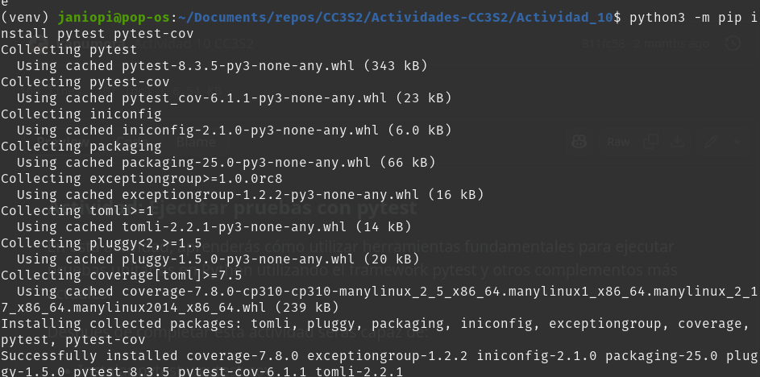
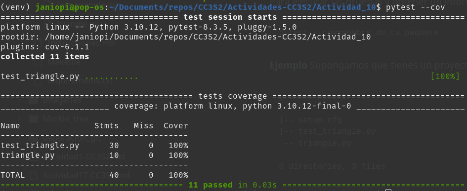
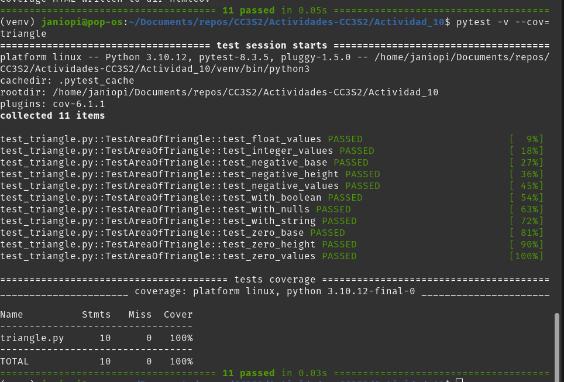
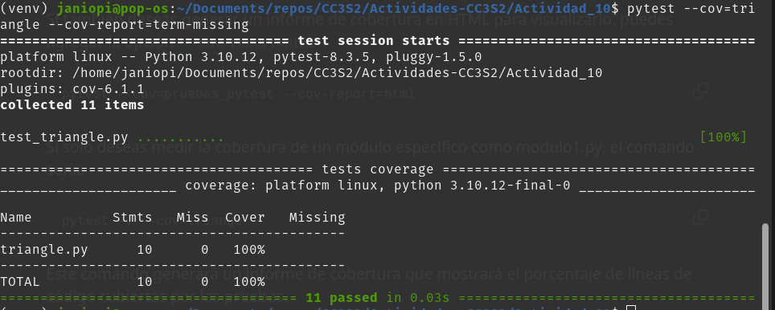
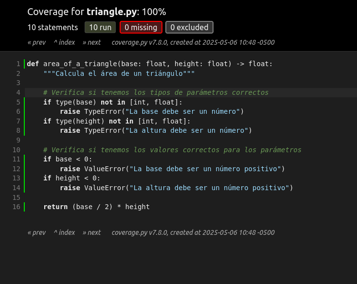
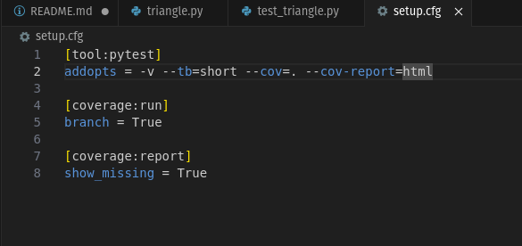

### Actividad: Ejecutar pruebas con pytest

En esta actividad, aprenderás cómo utilizar herramientas fundamentales para ejecutar pruebas unitarias en Python utilizando el framework pytest y otros complementos más actuales.

Después de completar esta actividad serás capaz de:

- Instalar pytest y pytest-cov
- Ejecutar pruebas unitarias con pytest
- Generar salida detallada y colorida para tus pruebas
- Añadir informes de cobertura a los resultados de tus pruebas

**Paso 1: Instalando pytest y pytest-cov**

Primero crearemos un entorno virtual de python


Vamos a empezar instalando pytest, que es un potente framework para pruebas en Python, y pytest-cov, que nos permitirá generar informes de cobertura de código.

En tu terminal, ejecuta el siguiente comando:

```
python3 -m pip install pytest pytest-cov
```

Esto instalará pytest para ejecutar pruebas y pytest-cov para generar informes de cobertura de código.



**Paso 2: Escribiendo y ejecutando pruebas con pytest**

pytest te permite escribir pruebas de manera sencilla sin necesidad de usar clases como en unittest. Ejecuta pytest con el siguiente comando para correr las pruebas dadas en la actividad:

```
pytest -v
```


La opción -v activa el modo detallado, mostrándote qué pruebas se ejecutaron y sus resultados. Si las pruebas pasan, verás una salida con texto en verde. Si alguna prueba falla, el texto será rojo.

En este casos todas todas las pruebas pasan satisfactoriamente (verde)

**Paso 3: Añadiendo cobertura de pruebas con pytest-cov**

Es importante saber cuánta parte de nuestro código está siendo cubierta por las pruebas. Para ello, usamos el complemento pytest-cov.

Para ejecutar las pruebas y obtener un informe de cobertura, utiliza el siguiente comando:

```
pytest --cov=nombre_de_tu_paquete
```



Si también deseas generar un informe de cobertura en HTML para visualizarlo, puedes agregar la opción `--cov-report=html`:

```
pytest --cov=pruebas_pytest --cov-report=html
```


index.html generado


Si solo deseas medir la cobertura de un módulo específico como modulo1.py, el comando sería:

```
pytest -v --cov=triange
```



Este comando generará un informe de cobertura que mostrará el porcentaje de líneas de código cubiertas por las pruebas.

Si deseas un informe más detallado que muestre las líneas que no están cubiertas, ejecuta el siguiente comando:

```
pytest --cov=triangle --cov-report=term-missing
```



Este informe te mostrará las líneas de código faltantes que no han sido cubiertas por las pruebas, permitiéndote enfocarte en aquellas partes del código que necesitan más casos de prueba.

Si además deseas un informe en HTML con el mismo detalle, puedes combinarlo de la siguiente manera:

```
pytest --cov=triangle --cov-report=term-missing --cov-report=html
```


**Paso 4: Añadiendo colores automáticamente**

pytest ya viene con soporte de colores por defecto, por lo que no necesitas instalar ningún complemento adicional para tener una salida visualmente agradable. Las pruebas que pasen se mostrarán en verde, y las que fallen en rojo.

Si por alguna razón los colores no se muestran, puedes forzarlos con la opción `--color=yes`:




**Paso 5: Automatizando la configuración de pytest**
En lugar de escribir todos los parámetros de configuración cada vez que ejecutes pytest, puedes guardarlos en un archivo pytest.ini o como se ha realizado aqui setup.cfg.

**setup.cfg**

Es un archivo de configuración general de todo el paquete o proyecto. Se puede usar para configurar varias herramientas relacionadas con el proyecto, como pytest, flake8, mypy, y otras herramientas que utilicen secciones específicas dentro del archivo.
Está diseñado para almacenar configuraciones de varias herramientas en un solo archivo.
Tiene una estructura con diferentes secciones para cada herramienta, que se define con encabezados como [tool:pytest] o [coverage:report], entre otros.

Es comúnmente utilizado cuando quieres centralizar la configuración del proyecto en un solo archivo.

La configuración de setup.cfg está configurada de la siguiente manera:

```
[tool:pytest]
addopts = -v --tb=short --cov=. --cov-report=term-missing

[coverage:run]
branch = True

[coverage:report]
show_missing = True
```

Este archivo te permitirá automatizar la configuración de las pruebas.

[tool:pytest]es una sección específica para configurar pytest.

- addopts: Opciones adicionales para pytest (en este caso, activa la salida detallada -v, el tipo de rastro corto para errores --tb=short, y la cobertura con informe de líneas faltantes --cov-report=term-missing).
- [coverage:run] y [coverage:report]: Configuración para la herramienta de cobertura, en este caso, para medir la cobertura de ramas (branch=True) y mostrar qué líneas faltan (show_missing=True).

**pytest.ini**

Es un archivo de configuración específico para pytest. Solo contiene configuraciones que pytest usa directamente.

Si quieres configurar solo pytest sin agregar configuraciones de otras herramientas o mantener la configuración más organizada para esta herramienta en particular, pytest.ini es una opción preferida.

Sigue una estructura más simple y directa que se parece a lo siguiente:

```
[pytest]
addopts = -v --tb=short --cov=. --cov-report=term-missing

[coverage:run]
branch = True

[coverage:report]
show_missing = True
```

**Importancia**

- setup.cfg es para múltiples herramientas en el proyecto, mientras que pytest.ini es solo para configurar pytest.
- En setup.cfg, las configuraciones de pytest deben ir bajo [tool:pytest].
- En pytest.ini, las configuraciones se agrupan bajo el encabezado [pytest], ya que el archivo solo es para esa herramienta.

**¿Cuál usar?**

- Si ya tienes un setup.cfg y deseas centralizar la configuración de varias herramientas en un solo archivo, puedes seguir usando setup.cfg.
- Si solo necesitas configurar pytest y prefieres mantener los archivos separados o más simples, entonces pytest.ini es una buena opción.

**Paso 6: Ejecutando pruebas con la configuración automatizada**
Una vez que hayas creado el archivo o setup.cfg pytest.ini, simplemente ejecuta pytest sin ningún parámetro adicional:

```
pytest
```

Esto ejecutará las pruebas con los parámetros definidos en el archivo de configuración, ahorrándote la necesidad de escribirlos cada vez.

- Configurando nuestro setup.cfg
  

- Ejecutando
  


