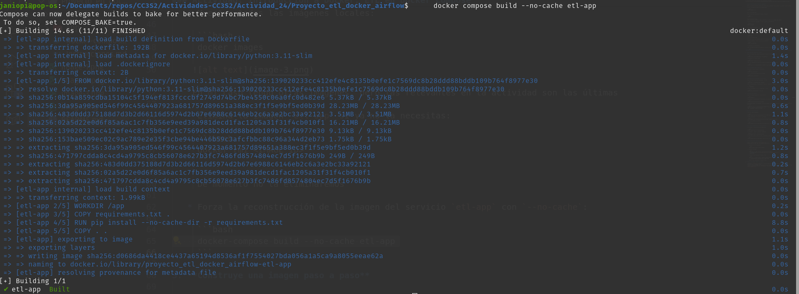

### Actividad: Introducción a Docker, ETL en Docker Compose

En esta actividad te adentrarás en el manejo práctico de Docker y la CLI de Airflow, trabajando directamente sobre el proyecto ETL desplegado con Docker Compose. 
Aprenderás a interactuar con contenedores, gestionar imágenes y redes, y a ejecutar y depurar tus DAGs de Airflow desde la línea de comandos. 

La referencia completa del proyecto está disponible en GitHub:
 [Proyecto docker y Airflow](https://github.com/kapumota/DS/tree/main/2025-1/Proyecto_etl_docker_airflow).


1. **Explora tus contenedores activos y parado**

    Nota: La versión de docker compose que utilizo usa el comando `docker compose` en vez del `docker-compose`

   * Arranca el proyecto completo en segundo plano:

     ```bash
     docker-compose up -d
     ```

    

   * Lista todos los contenedores (running + stopped):

     ```bash
     docker ps -a
     ```
     
    
    (Anteriormente se realizó múltiples contenedores a partir de la imagen mencionada)
    
   * Frena y elimina el contenedor `etl-app` usando su CONTAINER ID:

     ```bash
     docker stop <ID>
     docker rm <ID>
     ```

    
    Eliminamos exitosamente un contenedor previamente creado


2. **Inspecciona imágenes y limpia tu sistema**

   * Muestra todas las imágenes locales:

     ```bash
     docker images
     ```
    

    En mi caso tengo otras imagenes, pero las relevantes en la actividad son las últimas

   * Elimina la imagen `etl-app` si ya no la necesitas:

     ```bash
     docker rmi <IMAGE_ID>
     ```

     De momento no la eliminaremos

   * Forza la reconstrucción de la imagen del servicio `etl-app` con `--no-cache`:

     ```bash
     docker-compose build --no-cache etl-app
     ```
    

    
3. **Construye una imagen paso a paso**

   * Desde la carpeta raíz, crea manualmente la imagen de la aplicación ETL:

     ```bash
     docker build -t mi_etl_app:latest -f Dockerfile .
     ```
    
   
   * Verifica que la imagen exista:

     ```bash
     docker images | grep mi_etl_app
     ```
    

   * Lanza un contenedor de prueba ejecutando el pipeline contra tu CSV local:

     ```bash
     docker run --rm -v $(pwd)/app/data:/app/data mi_etl_app:latest python pipeline.py
     ```

4. **Tira de imágenes desde Docker Hub**

   * Descarga la imagen oficial de PostgreSQL:

     ```bash
     docker pull postgres:15
     ```

     

   * Lista el historial de capas de esa imagen:

     ```bash
     docker history postgres:15
     ```

     

5. **Interactúa con un contenedor en ejecución**

   * Inicia un shell dentro del contenedor `etl-app`:

     ```bash
     docker exec -it <CONTAINER_ID> /bin/bash
     ```
    

   * Dentro del contenedor, comprueba que `input.csv` existe en `/app/data`:

     ```bash
     ls -l /app/data
     ```

    

   * Sal del contenedor (`exit`) y comprueba sus logs:

     ```bash
     docker logs <CONTAINER_ID> --tail 20
     ```

     

6. **Gestiona redes Docker**

   * Lista las redes creadas por `docker-compose`:

     ```bash
     docker network ls
     ```
   * Inspecciona la red que usan los servicios (`proyecto_default`):

     ```bash
     docker network inspect proyecto_default
     ```
   * Conecta manualmente un contenedor extra (por ejemplo, un Alpine) a esa red y verifica la conectividad con PostgreSQL:

     ```bash
     docker run --rm -it --network proyecto_default alpine sh
     apk add --no-cache postgresql-client
     psql -h postgres -U user -d etl_db -c '\l'
     ```

7. **Airflow básico desde CLI**

   * Lista tus DAGs disponibles:

     ```bash
     docker-compose exec airflow-webserver airflow dags list
     ```
   * Triggea manualmente `etl_pipeline` para hoy:

     ```bash
     docker-compose exec airflow-webserver airflow dags trigger etl_pipeline
     ```
   * Observa el estado de las tareas:

     ```bash
     docker-compose exec airflow-webserver airflow tasks list etl_pipeline --tree
     ```

8. **Sigue logs y diagnostica errores en Airflow**

   * En Terminal B, sigue los logs del webserver:

     ```bash
     docker-compose logs -f airflow-webserver
     ```
   * En Terminal C, sigue los logs del scheduler:

     ```bash
     docker-compose logs -f airflow-scheduler
     ```
   * En Terminal D, tras disparar el DAG, comprueba los logs de la tarea `extract`:

     ```bash
     docker-compose logs airflow-worker | grep extract -A10
     ```

9. **Integración docker-compose vs CLI**

   * Detén y elimina todo con `docker-compose down -v`.
   * Reconstruye y arranca solo con comandos Docker puros:

     1. Construye red y red interna:

        ```bash
        docker network create proyecto_default
        ```
     2. Arranca PostgreSQL:

        ```bash
        docker run -d --name postgres --network proyecto_default \
          -e POSTGRES_DB=etl_db -e POSTGRES_USER=user -e POSTGRES_PASSWORD=pass \
          postgres:15
        ```
     3. Arranca etl-app vinculando volumen y red:

        ```bash
        docker run -d --name etl-app --network proyecto_default \
          -v $(pwd)/app/data:/app/data mi_etl_app:latest
        ```
     4. Muestra logs y comprueba la carga de datos.

10. **Retos adicionales "manos a la obra"**

    * Modifica el `Dockerfile` para usar un *multi-stage build* que pipistrelee solo las dependencias necesarias en el contenedor final.
    * Añade un volumen nombrado para persistir los datos de PostgreSQL y haz que tu `docker-compose.yml` lo use.
    * Crea un pequeño DAG nuevo en `airflow/dags/` que imprima la fecha actual en consola y pruébalo con `docker-compose exec`.

