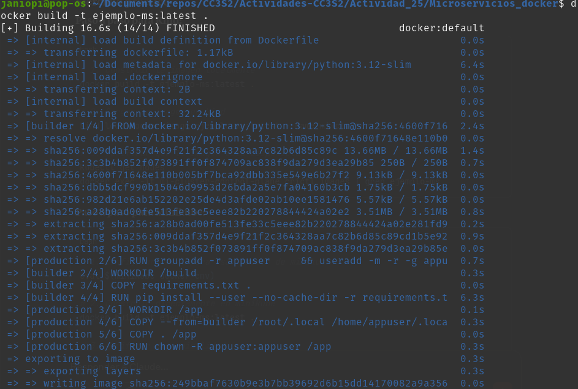
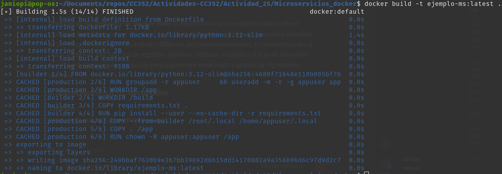
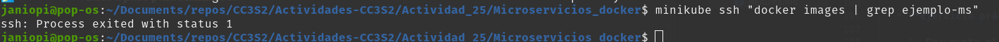

#### 1. Conceptualización de microservicios

**Objetivo**: Fundamentos y motivación. Comprender cuándo y por qué migrar de un monolito a microservicios, así como los principios de diseño que guían esta arquitectura.

> **Contexto**: Muchos proyectos inician como aplicaciones monolíticas. A medida que crecen, aparecen cuellos de botella en despliegue, escalado y mantenimiento.

1. **¿Por qué microservicios?**

   * Describe la evolución histórica desde arquitecturas monolíticas a SOA y finalmente microservicios.

    - **Monolitos tradicionales** (1990s-2000s): Aplicaciones desplegadas como una sola unidad, con toda la funcionalidad en un mismo proceso. Ventajas iniciales: simplicidad de desarrollo y despliegue.
    
    - **SOA - Service Oriented Architecture** (2000s): Surgió para abordar la rigidez del monolito. Servicios más grandes,enfoque "top-down" (toma de decisiones y planificación desde los niveles superiores hacia los inferiores de la organización).
    
    - **Microservicios** (2010s-presente): Evolución natural de SOA, pero con servicios más pequeños, enfoque "bottom-up"(prioriza el análisis detallado de componentes individuales para luego intregarlos y construir un sistema general) y mayor autonomía de equipos.


   * Presenta dos ejemplos de casos de uso (por ejemplo, ecommerce con picos de demanda y aplicación SaaS multi-tenant) donde el monolito se vuelve insostenible.

    - **Caso 1**: Plataforma de ecommerce con picos de demanda
    Una tienda online que experimenta picos masivos durante épocoas como el Black Friday. En el monolito:

        - Todo el sistema debe escalarse aunque solo el catálogo y checkout estén saturados
        - Un bug en recomendaciones puede tumbar toda la plataforma
        - Despliegues de nuevas funcionalidades requieren parar todo el sistema

    - **Caso 2**: Aplicación SaaS multi-tenant
    Un CRM que sirve a múltiples empresas con diferentes necesidades:

        - Algunos clientes necesitan funcionalidades específicas que ralentizan el desarrollo para otros
        - Personalización requiere modificar el código central
        - Escalado debe ser global aunque algunos módulos se usen poco


2. **Definiciones clave**

   * Define un **microservicio** y enumera sus características: despliegue independiente, enfoque en una única responsabilidad, contrato a través de APIs.

    Un microservicio es un servicio de software que:

        - Desplegable independientemente: Puede actualizarse sin afectar otros servicios
        - Responsabilidad única: Enfocado en una capacidad de negocio específica
        - Contrato bien definido: Interactúa a través de APIs estables
        - Ownership completo: Un equipo posee el servicio de extremo a extremo
        - Tecnológicamente diverso: Puede usar diferentes lenguajes/bases de datos

   * Define una **aplicación de microservicios**: colecciones de servicios que colaboran, balanceadores, gateways, y elementos de observabilidad.
 

    - Servicios de negocio: Los microservicios que implementan funcionalidades
    - API Gateway: Punto de entrada único, maneja autenticación, rate limiting, routing
    - Service Discovery: Registro y descubrimiento de servicios
    - Load Balancers: Distribución de carga entre instancias
    - Observabilidad: Logging, métricas, trazabilidad distribuida
    - Configuración centralizada: Gestión de configuraciones por ambiente


3. **Críticas al monolito**

   * Identifica dos problemas típicos: tiempo de despliegue global (cadencia lenta) y acoplamiento que obstaculiza el escalado separado.

    - Tiempo de despliegue global
        - Cadencia lenta: Cualquier cambio requiere desplegar toda la aplicación
        - Riesgo alto: Un bug en cualquier parte puede afectar todo el sistema
        - Coordinación compleja: Múltiples equipos deben sincronizar cambios
    
    - Acoplamiento y escalado
        - Escalado uniforme: No se puede escalar solo las partes que lo necesitan
        - Acoplamiento técnico: Cambios en una parte pueden romper otras
        - Bottlenecks compartidos: Base de datos única, recursos compartidos

4. **Popularidad y beneficios**

   * Explica por qué grandes empresas (Netflix, Amazon) adoptaron microservicios.

    - Netflix: Migró para manejar millones de usuarios concurrentes, necesitaba resilencia ante fallos y capacidad de experimentación rápida.
    
    - Amazon: "Two pizza teams" - equipos pequeños y autónomos que pueden innovar independientemente.
   
   * Detalla tres beneficios clave: resiliencia (fallos aislados), escalabilidad granular y aceleración de equipos autónomos.

    - Resiliencia por aislamiento
        - Fallos se contienen en servicios específicos
        - Circuit breakers previenen cascadas de fallos
        - Degradación elegante de funcionalidades

    - Escalabilidad granular
        - Escalar solo los servicios que lo necesitan
        - Optimización específica por servicio
        - Mejor utilización de recursos

    - Aceleración de equipos autónomos
        - Despliegues independientes
        - Tecnologías adecuadas para cada problema
        - Reduce time-to-market


5. **Desventajas y retos**

   * Discute cuatro desafíos: necesidad de habilidades para redes y seguridad, complejidad de orquestación, consistencia de datos distribuidos y dificultades de testing.

    - Complejidad de red y seguridad
        - Comunicación entre servicios introduce latencia
        - Manejo de fallos de red parciales
        - Autenticación/autorización distribuida

    - Complejidad de orquestación

        - Gestión de múltiples servicios
        - Versionado y compatibilidad
        - Coordinación de despliegues

    - Consistencia de datos distribuidos
        - Transacciones ACID se vuelven complejas
        - Consistencia eventual
        - Sincronización de datos

    - Dificultades de testing
        - Testing de integración complejo
        - Ambientes de prueba más costosos
        - Debugging distribuido


   * Propón estrategias de mitigación: utilización de contratos OpenAPI, pruebas contractuales, herramientas de trazabilidad (Jaeger) y patrones de sagas.

    - Contratos OpenAPI: Definir contratos claros entre servicios, generar código automáticamente y mantener documentación actualizada.
    - Pruebas contractuales: Implementar consumer-driven contracts con herramientas  para garantizar compatibilidad.
    - Trazabilidad distribuida: Usar Jaeger para seguir requests a través de múltiples servicios.
    -  Patrones de sagas: Implementar transacciones distribuidas usando orchestration o choreography patterns.


6. **Principios de diseño**

   * Explica el **diseño orientado al dominio (DDD)** y cómo ayuda a delimitar límites contextuales para servicios.

    El Diseño Orientado al Dominio (DDD) es una filosofía de desarrollo de software que enfatiza la importancia de comprender y modelar el dominio empresarial. Es una estrategia que busca mejorar la calidad del software alineándolo mejor con las necesidades empresariales que satisface.

    - Colocar los modelos y reglas de negocio de la organización, en el core de la aplicación
    - Basar nuestro dominio complejo, en un modelo de software.
    - Se utiliza para tener una mejor perspectiva a nivel de colaboración entre expertos del dominio y los desarrolladores, para concebir un software con los objetivos bien claros.

   * Analiza el principio **DRY** en microservicios: promover bibliotecas compartidas versus duplicación controlada.

    El principio DRY(Dont repeat Yourself)
    - Bibliotecas compartidas (para lógica estable):
        - Utilidades comunes (logging, métricas)
        - Modelos de datos compartidos
        - Clientes para servicios externos
    -  Duplicación controlada (para lógica de negocio):
        - Validaciones específicas por contexto
        - Lógica de negocio propia de cada servicio
        - Evitar coupling temporal entre servicios


   * Discute criterios para decidir el tamaño de un servicio (ej. regla de la "una tabla por servicio" o "una capacidad de negocio por servicio").
    - Regla "una tabla por servicio": Cada servicio posee sus datos completamente, evita shared databases.
    - Regla "una capacidad de negocio por servicio": Alinear servicios con capacidades de negocio identificables por los stakeholders.


**Despliegue en Kubernetes local**

1. **Preparar y cargar la imagen**

   * **Teórico**

     * Explica por qué no necesitas un registry público en `kind` o `minikube`.

        - Los clusters locales como  `kind` y `minikube` permiten cargar imágenes directamente desde el daemon de Docker local, evitando así la necesidad de un registry externo. 

        - `Docker daemon: Servicio en segundo plano que se encarga de administrar los objetos de Docker como imágenes, contenedores, volúmenes, redes


     * Compara `eval $(minikube docker-env)` vs `kind load docker-image`.


   * **Ejercicio práctico**

     1. Documenta el paso a paso para:

        * Construir localmente `docker build -t ejemplo-ms:latest .`
            
        * Cargar esa imagen en `kind` (comando exacto) o en `minikube`.
            - Configurar shell para usar daemon de minikube
            

            - Construir directamente en minikube
            

            - Verificar disponibilidad
            


     2. Justifica, en un breve párrafo, las ventajas de no depender de Docker Hub.

    - **Ventajas de no depender de Docker Hub**: El desarrollo local sin registry público ofrece múltiples beneficios: mayor velocidad al eliminar tiempos de push/pull, privacidad completa de las imágenes en desarrollo, trabajo offline sin dependencias externas, y costos reducidos al evitar límites de rate limiting de registries públicos. Además, simplifica el flujo de desarrollo permitiendo iteraciones rápidas sin preocuparse por versionado o gestión de repositorios remotos.


2. **Manifiestos YAML esenciales**

   * **Teórico**

     * Estructura mínima de un `Deployment`: réplicas, `selector.matchLabels`, contenedor, `readinessProbe` y `livenessProbe`.
     ```
        apiVersion: apps/v1
        kind: Deployment
        metadata:
            name: ejemplo-ms
        spec:
            replicas: 2
            selector:
                matchLabels:
                app: ejemplo-ms
            template:
                metadata:
                    labels:
                        app: ejemplo-ms
                spec:
                    containers:
                    - name: api
                      image: ejemplo-ms:latest
                      imagePullPolicy: Never  # Crucial para imágenes locales
                        ports:
                        - containerPort: 8000
                       readinessProbe:
                        httpGet:
                            path: /health
                            port: 8000
                        initialDelaySeconds: 5
                        periodSeconds: 10
                       livenessProbe:
                        httpGet:
                            path: /health
                            port: 8000
                        initialDelaySeconds: 15
                        periodSeconds: 20
     ```
     
     
     
     * Tipo de `Service`: ClusterIP vs NodePort vs LoadBalancer (mínimo para local).

        - ClusterIP: Solo accesible dentro del cluster (por defecto)
        - NodePort: Expone el servicio en un puerto del nodo (30000-32767)
        - LoadBalancer: Para producción, en local actúa como NodePort

   * **Ejercicio práctico (teórico-codificación)**

     1. Redacta un `Deployment` YAML para tu API con 2 réplicas y probes HTTP (define endpoint y thresholds).

    ``` 
    apiVersion: apps/v1
    kind: Deployment
    metadata:
        name: ejemplo-ms
        labels:
            app: ejemplo-ms
    spec:
        replicas: 2
        selector:
            matchLabels:
            app: ejemplo-ms
        template:
            metadata:
                labels:
                    app: ejemplo-ms
            spec:
            containers:
            - name: api
                image: ejemplo-ms:latest
                imagePullPolicy: Never
                ports:
                - containerPort: 8000
                env:
                - name: ENV
                value: "development"
                resources:
                requests:
                    memory: "64Mi"
                    cpu: "100m"
                limits:
                    memory: "128Mi"
                    cpu: "200m"
                readinessProbe:
                httpGet:
                    path: /health
                    port: 8000
                initialDelaySeconds: 10
                periodSeconds: 5
                timeoutSeconds: 3
                failureThreshold: 3
                livenessProbe:
                httpGet:
                    path: /health
                    port: 8000
                initialDelaySeconds: 30
                periodSeconds: 10
                timeoutSeconds: 5
                failureThreshold: 3

    ```

2. Crea un `Service` de tipo NodePort que exponga el puerto 8000 en el nodo.

3. **Operaciones con `kubectl`**

   * **Teórico**

     * Comandos clave:

       * `kubectl apply -f k8s/`: Aplica todos los manifestos del directorio, creando o actualizando recursos
       * `kubectl get pods,svc`: Lista pods y servicios con su estado actual
       * `kubectl delete -f k8s/`: Elimina recursos definidos en los manifestos
       * `kubectl port-forward svc/ejemplo-ms 8080:8000`: Túnel local al servicio (Puerto local: Puerto del contenedor)

     1. Anota los comandos para:
    ```
        # Conectar terminal a minikube (si es necesario)
        eval $(minikube docker-env)

        # Desplegar todos los manifiestos
        kubectl apply -f k8s/

        # Verificar estado
        kubectl get pods,svc -o wide

        # Abrir servicio en navegador
        kubectl port-forward svc/ejemplo-ms-service 8080:8000
        # Ahora accesible en http://localhost:8080
   ```
      
     2. Describe cómo verificarías, con `kubectl logs`, que cada pod arranca sin errores.

    ``` 
        # Ver logs de todos los pods del deployment
        kubectl logs -l app=ejemplo-ms -f

        # Ver logs de un pod específico
        kubectl logs ejemplo-ms-deployment-abc123-xyz89

        # Ver logs de contenedor específico (si hay múltiples)
        kubectl logs ejemplo-ms-deployment-abc123-xyz89 -c api

        # Ver logs con timestamps
        kubectl logs -l app=ejemplo-ms --timestamps=true

        # Ver logs de los últimos 10 minutos
        kubectl logs -l app=ejemplo-ms --since=10m
    ```
4. **Pruebas, limitaciones y CI/CD**

   * **Teórico**

     * Impacto de Kubernetes en el ciclo de feedback: ¿por qué puede ser más lento que Docker Compose?

    - Tiempo de scheduling: Kubernetes debe decidir dónde colocar los pods
    - Health checks: Readiness y liveness probes añaden tiempo de startup
    - Service discovery: DNS interno y balanceadores de carga
    - Complejidad de debugging: Múltiples capas de abstracción


     * Introducción a pipelines CI/CD: GitHub Actions, GitLab CI o Jenkins para despliegue automático.

     1. Propón un flujo de CI que, tras cada push a `main`, ejecute: build de Docker, tests automatizados y despliegue a un cluster de staging.

    ```
    # .github/workflows/ci-cd.yml
    name: CI/CD Pipeline

    on:
        push:
            branches: [ main ]
        pull_request:
            branches: [ main ]

    jobs:
        test:
            runs-on: ubuntu-latest
            steps:
            - uses: actions/checkout@v3
            
            - name: Setup Node.js
            uses: actions/setup-node@v3
            with:
                node-version: '18'
            
            - name: Install dependencies
            run: npm install
            
            - name: Run tests
            run: npm test
            
            - name: Run linting
            run: npm run lint

    build-and-deploy:
        needs: test
        runs-on: ubuntu-latest
        if: github.ref == 'refs/heads/main'
        
        steps:
        - uses: actions/checkout@v3
        
        - name: Build Docker image
        run: |
            docker build -t ejemplo-ms:${{ github.sha }} .
            docker tag ejemplo-ms:${{ github.sha }} ejemplo-ms:latest
        
        - name: Setup Kind cluster
        uses: helm/kind-action@v1.4.0
        with:
            cluster_name: staging
        
        - name: Load image to Kind
        run: |
            kind load docker-image ejemplo-ms:${{ github.sha }} --name staging
        
        - name: Deploy to staging
        run: |
            sed -i 's/ejemplo-ms:latest/ejemplo-ms:${{ github.sha }}/g' k8s/deployment.yaml
            kubectl apply -f k8s/
        
        - name: Wait for deployment
        run: |
            kubectl rollout status deployment/ejemplo-ms --timeout=300s
        
        - name: Run integration tests
        run: |
            kubectl port-forward svc/ejemplo-ms-service 8080:8000 &
            sleep 5
            npm run test:integration
    ```


     2. Justifica qué herramientas (y por qué) integrarías para garantizar rollbacks seguros y visibilidad de logs.
